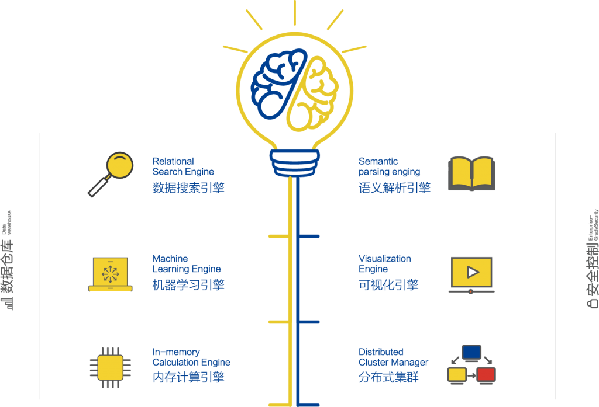

如今数字化管理已经深入人心，可视化数据分析大屏几乎成为企业标配。可是有的企业花大价钱配置了DataFocus却提高不了多少效益，如今经济低迷，企业利润薄如刀片，花最少的钱办出最好的效果，好钢用在刀刃上才是王道。小编就带大家看看企业数据分析的主要成本有哪些方面。

企业要开展数字化管理，进行数据分析和可视化展示，开发数据可视化大屏，主要的成本来源有这样几个方面：

第一个，工具成本。如今数据可视化分析工具有很多，国外的如Tableau，国内的如DataFocus等等。当然也有一些开发工具，但是小编真心不推荐使用。可视化产品功能已经足够强大，效果也能满足大部分企业的需求，没必要为一些特殊效果开发一大堆的代码。

第二个，人工成本。有了好的可视化数据分析工具或产品，还需要有可视化数据分析团队或者数据分析部门来用好他，用它开发相应的图表和大屏，才能发挥最大的效益。好的工具，能够事半功倍。比如DataFocus，它的图表开发都是搜索式，就像问问题一样，不需要写任何代码。

第三个，时间成本。同样式一个数据分析师，如果一分钟就能开发一个图表的话，他就能够节省大量的工作时间。有些报表开发人员可能深有体会，业务部门提上来的报表开发需求，写SQL没日没夜的干，还不能满足他们的需求。这个时候，你才会体会到好的工具是多么重要。

以上就是企业用DataFocus开发可视化数据分析的主要成本来源，企业只要把这三样成本花在刀刃上就能够花最少的钱，展现出最好的效果。
