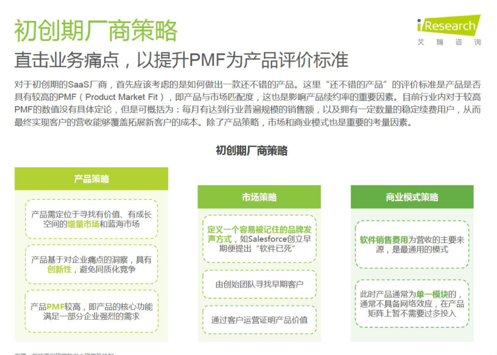

Gartner研究院高级副总裁Peter Sondergaard在一次报告上提出，数据是21世纪的石油，而分析则是内燃机。

一份优秀的数据分析报告能总结并反思过去，并预测未来趋势以指导现在的行动。那么问题来了，如何写好一份优秀的数据分析报告呢？

> 数据分析报告的目的

数据分析报告是你分析、思考、总结的结果，但是很多人写数据分析报告只是在写报告，把数据结果堆砌，把一大堆图表堆砌，完全没有主题、没有重点。

所以不光要有图表和数据，更重要的是要有重点突出，还要给上结论。作为数据分析师要敢于给出结论，因为这个结论是基于你所得到的所有数据基础，再加上你的逻辑推理得出的。不然你写的就只是一份数据报告而已。

数据分析就是通过对数据的理性分析得出结论，结论一定要明确，不能模棱两可。

同时也不要因为你的报告分析出来的“盖棺定论”就想办法回避。分析就是为了发现问题，才能解决问题，这正是体现你报告价值的地方。

> 确定数据分析报告的受众

企业高层一般想通过数据分析报告确定未来发展方向，也就是把握一个大方向。

企业中层一般想通过数据分析报告制定策略，也就是从整个项目把控细节，需要做到哪些细节对于真正的业绩是有效、有利的。

企业员工一般想通过数据分析报告指导具体执行。

> 建立报告框架

好的分析报告要有层次，层次分明才会让读者一目了然，这也是体现你整个报告的逻辑基点。

通过一个清晰明朗的目录，分别从几个角度来解读你的数据分析报告。

> 1. 尽量数据可视化

不要创造太多难懂的词汇，尽量能让读者快速理解你的意思。如果确实专业性很强，不妨写一个简单易行的“名词解释”。数据分析报告要做到言简意赅，能用一张图说明的就不用放文字说明了。而使用恰当的图表可以帮助读者更直观地看待问题。当然图表不宜过多，适当就好。

DataFocus可视化

> 逻辑一定要清晰

数据分析报告的逻辑基本遵循数据分析的逻辑思路，通常要遵照：发现问题--总结问题原因--解决问题，这样一个流程，逻辑性强的数据分析报告也容易让人接受。当然你还可以按照，发现现象——解释原理——实际应用这样一个逻辑环。无论如何，数据分析报告一定要脉络清晰，有理有据。

> **数据分析报告要真实可靠**

数据分析报告的真实可靠主要体现在两个方面，即数据的真实和数据分析的可靠。如果数据本身就出现了问题，那这份分析报告就没有任何说服力。

不能捏造数据，也不要有猜测性的结论，太主观的东西会没有说服力，尽量避免出现"可能，大概，或许"等字样，这会让数据分析报告的含金量大大降低。数据分析报告是严谨且真实的，可以基于数据预测，但不能凭空臆造。

> 提供解决方案

好的分析报告一定要有解决方案和建议方案，你既然很努力地去了解，并在了解的基础上做了深入的分析，那么这个过程就决定了你可能比别人都更清楚，发现了问题及问题产生的原因，那么在这个基础之上基于你的知识和了解，做出的建议和结论想必也会更有意义，而且受众也肯定不希望你只是个会发现问题 的人，也请你直言不讳的指出解决办法吧。

. 

当然，一份优秀的数据分析报告少不了一款优秀的数据分析工具。DataFocus作为全球首个中文类自然语言数据搜索分析系统，可以让不懂代码、不会SQL语句的营销人员在3秒内完成图表制作，10分钟创建出美观的可视化大屏，真正为营销人员节省时间、节省成本、节省精力。点击阅读原文可免费试用。
