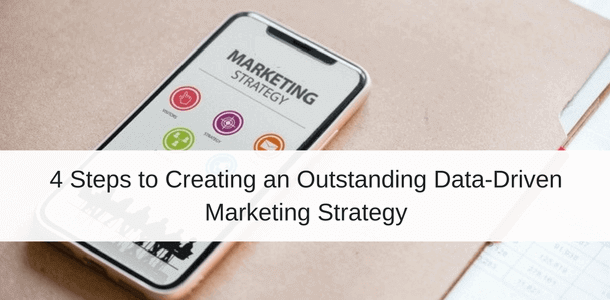

“想要经受住时间考验的营销人员必须开始利用数据来推动实时营销策略和有影响力的消费者联系。” -帕特里克·萨利尔

如果您希望在当今的数字战场上竞争，那么对您的营销策略采取数据驱动的方法不再是可选的，而是必要的。

事实上，最近的研究表明，64% 的营销主管“强烈同意”数据驱动的营销对于在竞争激烈的全球经济中取得成功至关重要。当代消费者精通技术，缺乏时间，要求比以往任何时候都高。在当今世界，千篇一律的销售信息或横幅广告是徒劳的，不会激发、吸引或赢得转化。在当今世界，您必须在个人层面上接触您的目标受众——而数据驱动的营销策略就是答案。

数据使营销人员能够在最准确的时刻，精确定位与消费者最相关的信息。人们每天收到 300 到 3000 条营销信息，但最多只能保留 3 条。这就是为什么你的必须算数。

如果您没有在消费者旅程中的正确时间创造和呈现有意义的、个性化的内容，那么您将错失成长和发展品牌或业务的重要机会。为了帮助您提高品牌知名度，以战略性、可持续的方式扩大受众并提高转化率，我们将研究如何通过四个可操作的步骤创建出色的数据驱动营销战略。

然而，在我们深入研究之前，让我们看一下数据驱动营销的定义：简而言之，它指的是基于消费者行为和交互的数据分析得出的营销洞察力、行动和决策。现在我们已经了解了数据驱动营销的定义，让我们继续我们策略指南的第一步。

## 创建您的团队并设定基于数据的目标

在收集、分析和使用任何消费者数据来构建您的策略并与您的目标消费者群建立联系之前，您需要建立合适的团队来实施您的策略。

为确保处理您的数据的团队平衡，理想情况下，它应该包括来自企业不同部门的成员，为有效的、跨学科的数据驱动营销策略奠定基础。谈到这个问题，Richard Bayston解释说：“这不仅意味着 IT 部门的人要和经理认为认为可以腾出的、最好的销售人员一起工作。还意味着你必须找到“愿意超越自己知识领域”的人。

一个真正出色的数据驱动营销策略团队应该由愿意合作、分享想法并超越其专业领域以实现一个共同目标努力的人组成。

组建好数据战略团队后，您必须建立明确的战略目标：[营销 KPI](https://www.datafocus.ai/infos/kpi-examples-and-templates-marketing)。为确保您获得对您的业务最有价值的见解，您首先需要确定值得收集的数据。

作为一个团队，讨论将对您的营销策略产生积极影响的数据流，并决定将提高您的活动有效性的数据类型，重点围绕真正帮助您的关键关键绩效指标 (KPI) 收集数据，这将真正帮助你挑战极限。

## 收集您的数据

为了获得成功的数据驱动营销策略的回报，你必须收集所有你认为与你的最终目标和 KPI 相关的见解。

为此，您应该从这些主要数据类型中收集信息：

- 内容绩效数据：在公共领域的公共指标，例如社交媒体绩效、现有内容的成功率（评论、分享、喜欢和搜索可见性）以及最近活动的成功率（消费者反应，它是否像病毒一样传播？）公共领域。
- 营销和社交媒体分析（点击、印象、转化率等）
- 消费者和潜在客户数据（包括网络行为、交易、在线活动和任何其他社交网络活动）
- 定性数据（个人信息和见解将帮助您使您的活动人性化）

在咨询平台，如 Google Analytics ，建立自定义报告，以根据用户与您网站的交互方式以及基于人口统计的数据（包括年龄、位置、设备偏好和兴趣）来收集和解读统计数据和指标。创建[Google Analytics 仪表板](https://www.datafocus.ai/infos/dashboard-examples-and-templates-google-analytics)将帮助您更快、更有效地理解它。

收集新见解不仅可以帮助您建立目标受众的个人档案，而且历史数据还可以帮助您制定和指导您的营销策略。此外，通过查看您的博客帖子和社交媒体内容的表现，您将能够了解哪些有效，哪些需要进一步改进，从而显着提高与受众互动的机会。

除了类似 Google Analytics 的平台之外，您还可以通过以下其他方式获得基于上述数据类型的有价值的洞察：

**买家角色**

Mark W. Schaefer 的一项研究表明，三到四个买家角色通常占品牌销售额的 90% 以上。

买家角色对于任何数据驱动的营销活动都至关重要。买家角色不仅提·供了一种与目标受众亲密接触的有效方式，而且还确保您在所有内容营销工作中获得最佳结果。

通过进行详细的市场调查并整理来自 Google Analytics 的来源和媒介以及兴趣和用户人口统计指标，并使用这些信息来构建代表您理想消费者的最完整资料，您将能够对所有营销工作采取有针对性的方法，并与您的潜在客户亲自联系。_结果如何？_提高品牌知名度和提高转化率。

为了让您开始，这个买家个人的视觉资料将有所帮助：

【视频】

**竞争对手分析**

浏览竞争对手的博客、网站和社交媒体资料，以更深入地了解他们所涉及的主题、他们推广内容的方式以及他们最常使用的媒体类型。您可以将此信息用作您自己的内容产品的灵感；您还可以使用这些见解来发现可以建立或从新角度处理的话题和主题。

**关键词研究**

选择一组有价值的关键字是数据驱动营销策略成功的关键。为了帮助您创建用于增强策略的 SEO 效力的最佳的短尾和长尾关键字列表，有几种分析和比较工具，包括 Google 的关键字规划器、SEMrush和Neil Patel 的 Ubersuggest。这些工具不仅可以帮助您选择对你的活动更有价值的术语和词，而且它们还会建议替代方案并让您深入了解搜索量和流量竞争。

**趋势**

根据您的行业、产品或服务发现热门话题将对您的战略最有价值。为此，您可以咨询Google Trends和 Twitter Trends，以发现最受欢迎的主题，并为您的电子邮件通信、社交媒体帖子、博客内容等获得有针对性的灵感。

## 创建您的内容营销框架

目前，仅有7% 的 B2B 营销人员 _没有_将内容营销作为其整体数字战略的关键部分。引人入胜、鼓舞人心、相关且有价值的内容是数据驱动营销的基石，这意味着您的整体战略的内容营销元素是一个很大的关注点。

为了给您提供构建内容营销框架，以优化您的营销活动所需的所有要素，您可以阅读我们关于构建 [数据驱动的内容营销策略](https://www.datafocus.ai/infos/data-driven-content-marketing-strategy)的指南。

## 放大、分析、测试、睡眠、重复

一旦您收集了数据、建立了买家角色，并建立了您的内容营销框架，就该采取行动，将您的内容和营销资产扩大或分发给您的目标受众。

为此，您应该花一些时间研究您的企业当前使用的分销渠道，分析哪些渠道最有效。还应该一个团队，一起考虑可能会利用的新兴社交平台。

在制定了明确的分销渠道列表，并根据价值和重点对其进行优先级排序后，您应该为所有内容和营销活动制定计划，并注明在何时何地与您的受众分享您的资产。这样做不仅可以为您的数据驱动营销策略的呈现所需的方向，还能够确保你的所有努力都能够获得最大的用户粘性和最佳结果。

可靠的分销计划将使您摆脱任何一个平台或渠道的束缚。但要让它发挥作用，你必须有条不紊地计划你的传播和扩大行动。建立[营销报告](https://www.datafocus.ai/infos/daily-weekly-monthly-marketing-report-examples) ，跟踪你设定的行动，将帮助您保持正确的道路。

最后，也许也是最重要的一点：数据驱动的数字营销主要是为了获得新的见解，并调整或发展您的计划，以推动可持续的商业成功。

考虑到这一点，您需要不断收集和分析新数据，测试有效和无效的元素。[营销仪表板](https://www.datafocus.ai/infos/dashboard-examples-and-templates-marketing)在此过程中不仅是一个有用的、方便的工具，如果您不想丢失您收集的所有数据，也不想让它变得模糊，它们是至关重要的。通过这样做，您将保持可信度，保持相关性，并在正确的时间继续与正确的消费者建立联系，这无疑会给你带来长期的成功。

要开始了解您的营销数据并创建专业仪表板，请尝试我们的 [30 天免费试用](https://www.datafocus.ai/console/)！
