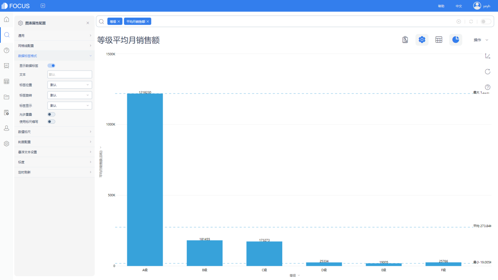

## 如何用DataFocus对Excel表中数据进行筛选?

在DataFocus系统中，对于Excel表数据的筛选，可以直接使用系统支持的关键词来实现。

## 一、创建数据

用DataFocus系统进行数据筛选前，需要先将本地Excel数据表导入到系统中。大致流程如下：

1. 数据表管理模块的“导入表”栏下选择导入本地文件（或资源管理功能模块中点击“创建资源”按钮）。
2. 选定“EXCEL”文件类型，并在选择本地文件后点击“上传“。
3. 上传成功后的 Excel表配置信息界面，可以选择导入的列、重新命名表名及列名、修改列类型等等，配置完成确认无误后点击“确定”完成上传。

## 数据筛选

对数据的筛选，是在DataFocus系统的搜索模块实现的。进入系统搜索模块，选择数据源表后，即可以通过双击或搜索框中输入列名的方式选择数据源列。

可直接在搜索框中输入关键词来进行数据的筛选。关键词包括筛选关键词、排序关键词、聚合关键词、日期关键词、时间关键词、字符串关键词、增长关键词、分组关键词、vs关键词等等。

### 2.1 按条件筛选

按条件筛选包括按指定的数值条件筛选、按指定的日期条件筛选、按指定的文本条件筛选等等。

#### 2.1.1 数值筛选

对于数值列的数值筛选，除了可进行“大于/>”、“等于/=”、“小于等于/<=”等常规条件筛选，也可以直接筛选出排名第几到几的数值。例如，图中一份员工业绩表，通过输入“姓名”、“排名前2的业绩”，直接筛选出业绩在前2的员工及其业绩。

图表2. 1 数值筛选

#### 2.2.2日期筛选

通过时间日期关键词，可以直接对日期列中的日期进行数据筛选。

例如：

A、查看一份电商数据表中，2019年每月的销售金额。

图表2. 2 日期筛选

B、查看某时间范围的销售金额

图表2. 3 时间范围筛选

#### 2.2.3文本筛选

在DataFocus系统中，对属性列进行文本内容的筛选，可以使用“包含”、“不包含”、“开头是”、“结尾不是”、“=”等关键词。

例如，搜索框中输入列名“区域”、“销售金额”，筛选条件 区域=“华南”，来查看数据表中华南区域的总销售金额。

图表2. 4 文本筛选

### 2.2 排序

在DataFocus系统中，对于数据的排序，除了使用排序关键词，也可以直接在展现的图表中进行设置。

使用关键词进行排序时，直接在搜索框中输入想要进行排序的列名以及排序方式。如图，按销售数量进行升序排列。

图表2. 5 关键词排序

除了使用关键词进行排序，可以在图形中通过点击对应轴的设置弹窗内的“排序”按钮进行排序设置；也可以在数值表中点击想要进行排序的列名，进行排序。首次点击均会以降序的方式排列，再次点击则是以升序的方式排列。此时排序的方式也会出现在图表标题下方而不是搜索框中，如图所示。

图表2. 6 图形中设置排序

图表2. 7 图表中设置排序

以上，是用DataFocus系统对Excel表中数据进行简单的筛选查看，除了关键词的使用，也可以通过公式进行筛选并计算，更加复杂的筛选方式，等着大家去实践哦~
