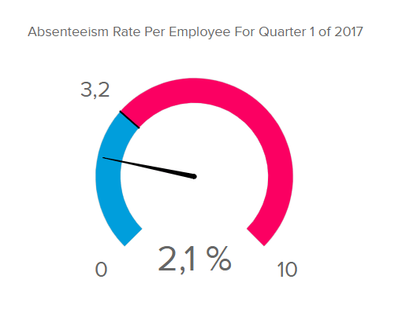
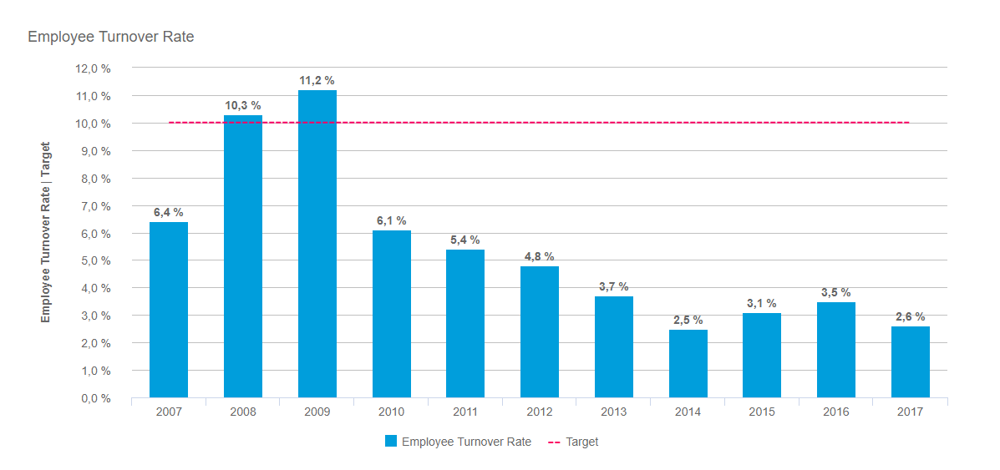

你的公司不是心理学家办公室。这不是一个生活指导机构。这不是一个社交俱乐部。那么，为什么让员工满意（也就是快乐和敬业）如此重要呢？答案很简单。它归结为冷酷、艰难的财务状况。研究支持这样一种观点，即让员工满意的公司比不满意的公司具有更大的优势。满意的员工：

- 更有生产力
- 更规律地来上班
- 不太可能离开去做另一份工作

你如何衡量这种参与或脱离？您如何使用这些结果，并衡量它们随时间的演变？您可以先做公司中其他大多数业务部门已经在做的事情：跟踪衡量员工满意度的特定人力资源 KPI，并通过可靠的 HR 仪表板对其进行编译和可视化。就像许多其他业务部门一样，人力资源部门正在演变为一个数据驱动的职能部门。这并不意味着“人”的一面消失了，相反，它可以更好地被评估，行为、动机等可以被跟踪和更好地考虑。这将帮助您的企业做出明智的人才决策、评估员工的绩效并进行更好的劳动力规划。

[商业智能在人力资源](https://www.datafocus.ai/infos/business-intelligence-human-resources)中的应用导致了劳动力分析的发展。越来越多的公司关心人力资源分析，并借助 [数据可视化软件](https://www.datafocus.ai/infos/data-visualization-tools) 进行管理，使他们能够生成范围广泛的仪表板和报告，从劳动力人口统计和分布到招聘报告。但收集数据并没有什么帮助，因为数据只有在讲述故事时才有价值。为了帮助您跟踪您想要的员工敬业度指标并采取行动，在本文中，我们将为您回答两个问题：

1. 你如何衡量员工的满意度？
2. 您如何提高工作满意度？

在这篇文章的结尾，你将会获得在这两个领域你可以采取的可行步骤。

## 如何衡量职场的满意度

不断雇用和培训新候选人是一个非常昂贵的过程。People Keep 表示：“一些研究预测，企业每次更换一名受薪员工，平均要花费 6 到 9 个月的工资。对于一个年收入 4万 美元的经理来说，招聘和培训费用是 2万 到 3万美元”。此外，通过招聘流程填补职位的痛苦和消耗，使得尽可能长时间地留住优秀员工成为明智之举。你可以通过让他们更满意来做到这一点。

BI 界有句谚语，“无法衡量的东西，无法改进”。这也适用于更主观、更少量化的指标——因此需要定义和跟踪一些员工满意度指标。在衡量员工满意度时，同样重要的是要注意定性数据比定量数据更重要。有什么不同？

- _定量数据_可以单独用数字表示，最适合“广泛而浅显”的信息收集方式。在尝试全面了解员工的感受时，此类数据非常有用。
- _定性数据_来自采访、聊天和开放式问题等。这很难用指标来衡量，但它通常比纯粹的定量数据更诚实。在衡量员工满意度时，诚实是至关重要的——许多人会倾向于给你他们认为你想听到的答案。

您收集的所有数据都将受益于[仪表板构建器](https://www.datafocus.ai/infos/dashboard-builder)的使用，它可以让您在引人注目的仪表板组合您需要的所有信息。现在，让我们回顾一下测量和收集这两种数据的一些实用方法。

### 1) 员工满意度指标

- **员工净推荐值**

在量化方面，我们将让事情变得非常简单。当谈到[客户满意度](https://www.datafocus.ai/infos/top-7-customer-kpis-and-metrics)时，一个常用的指标是净推荐值。该指标要求“在 1-10 的范围内，您推荐朋友或家人与我们开展业务的可能性有多大？”

要将其转换为衡量员工满意度，您所要做的就是问：“在 1-10 的范围内，您推荐某人为我们工作的可能性有多大？”

进行调查，以便人们可以匿名回答并愿意提供真实的答案。同时也要鼓励人们填写调查问卷，例如参加抽奖活动。您可以通过员工匿名回复来做到这一点，同时将员工是否回复作为yes或no字段来跟踪。

然后，您可以按如下方式分解分数：

- _非常满意_——给出 9 或 10 分的员工实际上可能会推荐别人为你工作。他们总体上很开心。
- _有点满意_——给出 7 或 8 分的员工可能不会推荐你的公司，但他们也可能不会说你公司的坏话。
- _不满意_\- 任何在你的一个问题调查中得到1-6分的人可能都不是很乐意为你工作。没关系 - 但你想改变这个么。

要计算您的员工 NPS 分数，请将“有点满意”类别放在一边。现在从“非常满意”的百分比中减去“不满意”的百分比，你就会得出你的 eNPS 数值。例如，如果您的结果显示 20% 的受访者“非常满意”，而 10% 的受访者“不满意”，那么您的 eNPS 分数将为 10。

如果您的样本量足够大，您可以随着时间的推移跟踪这些员工满意度指标，以了解有意义的趋势。

- **非正式聊天**

在衡量员工满意度时，获得定性数据的最佳方法之一是简单地带员工出去喝咖啡或吃午饭，并询问他们事情进展如何。尝试与友善和易于交谈的人来进行这些采访。 当我工作时，在这些非正式采访中提供了一些示例问题：

- 您认为我们在哪些方面做得很好？
- 我们哪里做得不好？
- 如果你可以改变你工作的一个方面，那会是什么？
- 你希望自己多做些什么？
- 你认为这个团队合作成功吗？为什么或者为什么不？
- 五年后你会在这里工作吗？为什么或者为什么不？

这更像是一个定性的员工满意度指标，它可以让您了解员工在工作中的感受，并在需要时采取行动。

- **建议箱**

我们关于衡量员工满意度的最终建议：只需拥有一个实体或在线匿名意见箱，就可以在一年中从您的员工那里获得反馈。积极鼓励人们使用这个盒子。

### 2) 员工敬业度指标【】

- **旷工率**

首先，我们的员工敬业度指标是非常明显的缺勤率。敬业的员工每天都在工作中感到有责任感，并每天都在工作中也就不足为奇了。高缺勤率将不可避免地影响您的工作效率，进而影响财务和工作氛围。高缺勤率背后可能有很多原因，您的管理层应该仔细检查每个原因并确保找到解决方案。Investopedia 概述了旷工原因、它们将引发的不可避免的成本以及您可以采取哪些措施来解决这个难题。您可以将此员工敬业度指标计算为上个季度天数的百分比：

缺勤率=（每名员工缺勤总天数）/（总工作日数）x 100

每个员工的总缺勤天数 = 总缺勤天数 / 总员工人数

在上面的示例中，您可以看到 2017 年第一季度的缺勤率，最高目标是 3.2%，这个季度未达到。

- **员工离职率**

_\*\*点击放大\*\*_

离职率是员工敬业度指标中另一个极具说服力的 KPI。有人说您应该将年度员工离职率控制在 10% 以下。在某些情况下，员工流动率高对公司有利，这样可以给公司带来新的观点和新的想法将其推向前进，并灌输变革。但是，大多数情况下，异常高的离职率只会损害您的业务并严重影响投资回报率。就像缺勤率一样，它将揭示需要额外关注和照顾的部门或单位，哪些部门或单位的员工工作得不是很好。您可以计算某个时期（月、季或年）的员工离职率，并将其表示为百分比：

离职率=（离职员工总数）/（期初员工总数）

在上面的例子中，我们可以看到公司在 2008 年和 2009 年的离职率目标表现不佳。它很可能已经调查员工的离职率下降到 2.5%的原因，并在过去几年一直保持在这个数字附近。

- **工作效率和盈利能力**

我们最终的员工敬业度指标也非常简单，并且与之前的指标直接相关：没有员工的敬业度，就不会出现预期的结果。如果您发现生产减少或放缓，如果销售额下降，这可能表明员工没有像他们可以或应该做的那样投入，必须采取一些措施。应该仔细观察的领域是生产率、客户满意度、产品开发和销量。评估某些单位陷入困境的原因并实施适当的解决方案以帮助提高员工的敬业度。

## 如何提高职场满意度

既然我们已经完成了衡量员工满意度并分析了各种员工敬业度 KPI 示例，我们将进入更难的部分——您如何_提高_ 员工满意度？

这里没有“快速解决方案”，但通过混合提问、动机心理学和战略薪酬，你可以拥有一些令人难以置信的快乐（和高效）的员工。

### 1）问是什么激励了他们

这听起来可能很简单，但提高工作场所满意度的最佳步骤之一就是询问您的员工，什么会让他们的工作更充实和更有吸引力。

你可能会想，“好吧，每个人都会要求更多的钱”。实际上并非如此。一旦金钱不再是限制因素，其他事情就变得更加重要。正如 Daniel Pink 的畅销书Drive: The Surprising Truth About What Motivates Us所示，从长远来看，金钱实际上是一个糟糕的激励因素。

事情是这样分解的：

1. 如果人们觉得他们的薪水过低，那么缺钱_可能_ 会影响员工的满意度和工作效率。
2. 然而，短期奖金和金钱奖励对工作效率和积极性有“反弹”效应；他们在短期内会增加努力，但从长远来看会减少努力。
3. 因此，作者丹尼尔·平克得出结论，从长远来看，其他因素对于激励的重要性要比金钱重要得多。

还有哪些其他因素可以激励人们？像：

- 目标感
- 一种在团队中的感觉，他们的存在很重要
- 感觉受到赞赏
- 感觉被认可

还有一些其他的员工敬业度指标，我们会在下面讲到。然而，让我们回到可行的步骤：与其猜测你的员工想要什么，不如问问他们。好的问题包括：“我们可以改变哪三件最重要的事来让你的工作更充实或更有吸引力？”

或者：“你现在工作中遇到的最大的、可以改变后使你的工作变得更好的挫折是什么？”

对于这些问题，尤其是第二个问题，最好不要透露姓名。员工通常不愿说出姓名或过于诚实，因为害怕受到报复

### 2）使用自决理论

自我决定理论是最新的心理学观点，用于研究是什么激励了人们并使他们快乐，是一种相当有效的员工敬业度指标。总而言之，一个快乐、高效的员工需要具备 3 个条件：让他们有机会感到自己有能力、与他人建立联系并能够控制自己当前的角色。让我们来分析一下。

**胜任的**

人类喜欢学习新技能并在现有技能上做得更好。当他们不得不一遍又一遍地做同样的任务而没有成长的机会时，他们就会变得无精打采(工作满意度也很低)。

_行动步骤_：确保您的每位员工能够在日常工作中培养至少一项新技能或“提高”现有技能。让您的员工在合理的范围内选择他们想学习的技能（他们可以节省空闲时间来学习）。

**与他人联系**

从本质上讲，人类是社会性动物。我们享受与他人面对面的时光，而孤独对人类的危害与每天抽一包烟一样糟糕。工作场所不是酒吧或社交俱乐部，但它_应该_ 是人们与周围人联系的地方。想一想：当一个人与他们一起工作的人没有有意义的联系时，他怎么能觉得自己的工作很重要呢?

此外，通过经理使用诚实、具体的赞美，你可以让你的员工感到与你有联系。你会惊讶于一个诚实善良的“在XYZ项目上做得很好，你真的做到了这一点（具体方面）”带来的能量。

尽量强调具体的行动，而不是员工的个性。说，“这是对心烦意乱的顾客的巧妙处理”，而不是“你真的很擅长处理心烦意乱的客户”。这也避免了嫉妒和偏袒。

_行动步骤_：向您的员工询问他们真正喜欢的每周社交活动的想法。不要想出自己的想法，然后试图强迫人们玩得开心。示例可能包括：

- 垒球队或橄榄球队
- 公司欢乐时光
- 公司赞助的午餐

_行动第 2 步_：将其作为公司文化的一部分，突出员工每天以诚实、真诚的方式所做的出色工作。考虑每周发送一封电子邮件，向每位员工“喊话”，以表彰他们做出的有价值的贡献。

### 3）控制他们的直接角色

这方面的技术术语是自主权。基本上，您希望您的员工觉得他们可以做出重要的决定，而无需受到微观管理。这是一个非常有说服力的员工参与度指标，因为当员工必须为他们所做的每一件小事寻求批准时，会产生一种潜意识的信息，即他们没有足够的能力（或信任）来独立完成这些事情。这同样适用于过于频繁的状态更新/报告。

_行动步骤_：如果您的员工被需要每小时汇报一次最新情况，那么明智的做法是取消这种做法。此外，对每位员工的日常工作进行全面检查，确保他们能够完成至少 80% 的工作，而无需征求其他人的批准。

### 4）不要让金钱成为限制因素

早些时候，我们讨论了金钱实际上并不是大多数人的主要动力。话虽如此，如果人们觉得自己的薪水过低，钱_肯定会 降低员工的满意度。_

我不会将其作为员工敬业度 KPI 示例之一，因为您可以自己进行的评估。假设您有一位营销客户主管，您每年支付他 5万美元。如果您所在地区的所有其他营销客户主管的年收入都在 6万 美元及以上，那么您的员工很可能会感到不满，并可能最终离开您的公司。

这里的一个好策略（也是经济有效的）是确保你支付的薪水至少是你所在地区其他公司的“中等”薪水。这可能需要加薪，但从长远来看，你会为自己省钱。

毕竟，雇佣和解雇员工的成本很高，而且会给你的人力资源团队带来更多的工作和麻烦。让您的员工对体面的薪水感到满意是一种更好的做法。

## 关键要点

员工满意度和员工敬业度是两个相辅相成的方面。如果缺少第一个，则后者就无法表达，最终您的业务将受到严重影响。让您的员工满意是一项精明的财务举措。借助本文中的建议，您拥有衡量员工满意度所需的一切，这要归功于几个员工敬业度指标，并采取行动加以改进。但是，您还需要做一件事来管理测量结果——这就是现代[自助式商业智能软件](https://www.datafocus.ai/infos/self-service-bi-tools)介入的地方。通过帮助您以有意义的方式汇总和呈现您收集的各种员工数据，它可以使高层管理人员做出明智的数据驱动决策。

最终，您对员工福利的关注将为您带来竞争优势。
