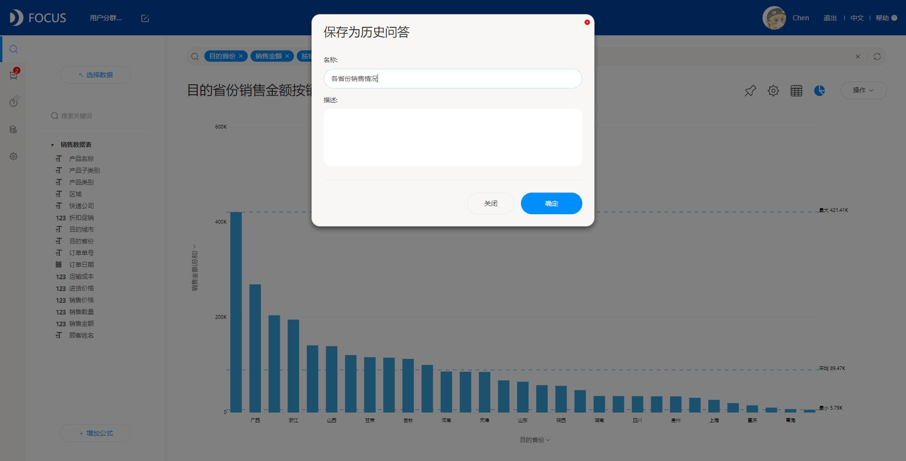

越来越多的公司专注于通过大数据分析和商业智能（BI）软件分析公司的业务和财务数据，以探索数据的价值并指导业务的发展。然而，许多公司发现在引入数据分析软件后业务没有太大改善。

这不是数据分析的价值，但公司没有梳理数据分析目标，方向，实施过程，并构建完整的数据分析应用程序架构，以形成清晰准确的“数据可视化管理面板”。 “，支持企业的相关业务决策。

在图像方面，“数据可视化管理面板”就像汽车的控制台。它通过详细的索引系统实时反映企业的运行状态，可视化，可视化和具体化采集的数据，并做出与业务相关的决策。提供支持。那么，企业应该如何构建“数据可视化管理面板”呢？以下是一些实施经验。

如何构建“数据可视化管理面板”

DataFocus高级数据分析师徐双流表示，驾驶舱结构可分为两部分：数据应用架构的构建和数据可视化平台的形成。其中，数据应用架构是指企业需要整理当前的业务需求和数据应用，并清楚地了解哪些业务可以用数据进行分析（如用户分析，衍生分析收入，库存分析，财务分析等）。 。）并通过“故事面板”的方式统一显示和管理这些数据分析结果。

这里应强调“故事小组”的作用，因为数据最重要的价值是在人工智能完全取代人类决策之前给予人们观点并提供决策支持，因此数据必须完全可以理解，可读。性别，以“故事式”方式表达的数据将更受欢迎。

Gartner在最新的Magic Quadrant报告中也指出，讲故事将是BI产品的重要发展趋势。通过自动应用视觉感知等最佳实践，可以更加生动地反映数据分析结果。当然，这也取决于高质量的数据分析师，以及出色的数据可视化工具。

除了讲故事数据分析的演示之外，公司还需要开发清晰的数据流程并开发数据素养。通过这种方式，在获得数据分析结果后，相关人员可以清楚地知道问题发生的位置，并通过读取数据分析结果知道如何提高相关业务绩效。

汽车经销公司管理驾驶舱的整体结构

从数据可视化平台的形成来看，数据可视化管理面板需要一个可以完全控制和完全显示的数据中心控制台，并在PC，大屏幕上以高度结构化的方式显示各种类型的数据图表，在平板电脑等媒体上，这更接近于“驾驶舱”的原始含义。

构建数据可视化管理面板的几条指南

要在企业内构建数据可视化管理面板，DataFocus建议用户遵循以下准则：

可理解性：数据可视化管理面板应将可理解性放在显着位置，这意味着需要充分考虑设备，不仅要通过最可接受的可视语言，还要通过适当的图表。组织联合解释某种类型的问题。

可配置性：可配置性意味着数据可视化管理面板需要支持用户根据业务需求或自身习惯灵活配置数据可视化管理面板的各种类型的图表。例如，图形可以反映各种指标。指标可以通过多个图形显示的交叉实现模式来实现，以使配置更加灵活。

综合性：由于数据可视化管理面板需要为用户提供决策支持，因此通过大量图表进行全面的数据分析和可视化显示非常重要。目前，许多公司的数据可视化管理面板包含数十个甚至数百个图表，每个图表都反映了不同维度的数据。分类和组织后，可以确保用户可以更全面地掌握公司的各项指标。

安全性和灵活性：数据可视化管理面板不仅可供客户使用，而且可以成为使整个企业受益的数据工具。这涉及安全性和灵活性问题。例如，应该严格区分公司的上层和中层可以查看的数据。在创建数据可视化管理面板的过程中，需要根据权限严格分离数据，同时确保不同类型的用户可以获得相应的见解。

DataFocus构建数据可视化管理面板的业务实践

借助DataFocus数据分析平台和DataFocus数据大屏幕显示平台，用户可以轻松开发数据分析和挖掘策略，构建高效的数据可视化管理面板。

DataFocus数据分析平台提供了强大的“故事面板”功能，不仅允许用户在同一面板上组织多个图表，输出故事板，还支持通过文本框，组件，图表等生成幻灯片和播放。无需导出数据和图表，快速生成报告文档，并立即回复业务问题。

DataFocus数据大屏幕显示平台使用户能够通过丰富的模板配置轻松组织和显示数据图表，以满足可理解性和可配置性的要求。此外，它还具有基于数据级别的权限管理，有效地保证了数据的安全性。
