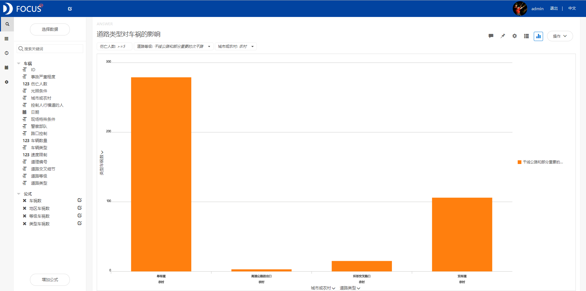
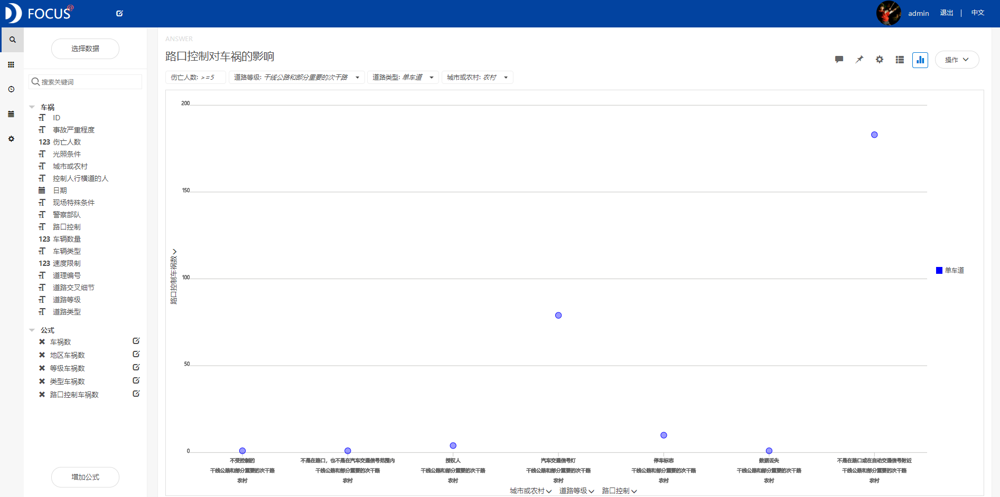
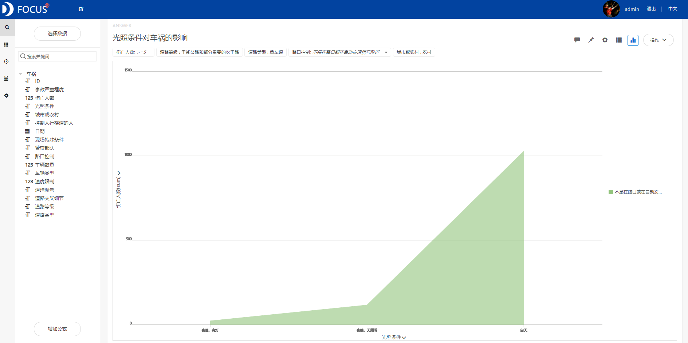
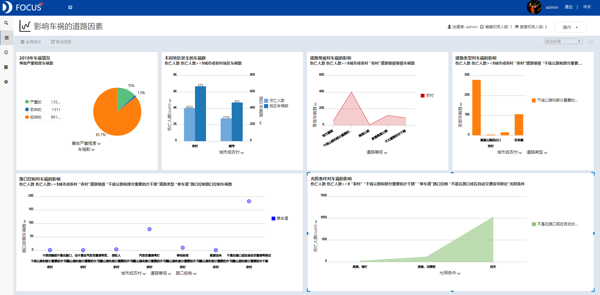

**定性分析**

定性研究是指研究者运用历史回顾、文献分析、访问、观察、参与经验等方法获得教育研究的资料，并用非量化的手段对其进行分析、获得研究结论的方法。定性研究主要是一种价值判断，它建立在解释学、现象学和建构主义理论等人文主义的方法论基础上。其主要观点是：社会现象不像自然现象那样受因果关系的支配，社会现象与自然现象有着本质的不同。

**定量分析**

定量研究的结果通常是由大量的数据来表示的，研究设计是为了是使研究者通过对这些数据的比较和分析作出有效的解释。

定量研究是一种事实判断，它是建立在实证主义的方法论基础上的。实证主义源于经验主义哲学，其主要观点是：社会现象是独立存在的客观现实，不以人的主观意志为转移。在评价过程中，主体与客体是相互孤立的实体，事物内部和事物之间必定存在内在的逻辑因果关系。

举个例子，比如我要分析影响车祸的道路因素，首先为了研究如何减少车祸发生的次数，首先通过饼图统计2010年车祸发生的严重情况，可以看到2010年一共发生车祸104029起，其中85.7%是轻微的，13%是严重的，1.3%是致命的。

就2010年发生的这104029起车祸进行分析，首先选择城市或农村的地区因素进行分析，对比城乡哪里更加容易发生车祸，2010年发生的伤亡人数在5人以上的车祸有1142起，其中有670起发生在农村，说明农村比城市更容易的发生车祸。

因此下面主要对农村发生车祸的道路因素进行分析，通过折线图观察不同道路等级对车祸的影响，发生车祸次数最多的道路等级是干线公路和部分重要的次干路，其发生车祸的次数远大于其他几种等级的道路。

因此在固定道路等级为干线公路和部分重要的次干路的情况下，下钻到不同道路类型对车祸的影响，发现发生车祸次数最多的道路类型是单车道，其次是双车道，最少的是高速公路进出口。

将道路类型固定为单车道，接下来通过[散点图](https://www.datafocus.ai/tag/%e6%95%a3%e7%82%b9%e5%9b%be" \o "【查看含有[散点图]标签的文章】" \t "https://www.datafocus.ai/_blank)对比路口控制的不同以及光照条件对车祸的影响。

得出最后的结论：①农村地区的路面条件较之城市，更加狭窄，因此司机在经过农村时要更加注意安全、②最容易发生车祸的是干线公路和部分重要的次干路的单车道，且不是在路口或自动交通信号附近，如遇这种类型的道路要格外注意、③不要因为是白天就放松警惕，白天其实比晚上更加容易发生车祸。

其实定性研究有两个不同的层次，一是没有或缺乏数量分析的纯定性研究，结论往往具有概括性和较浓的思辨色彩；二是建立在定量分析的基础上的、更高层次的定性研究。

在实际研究中，定性研究与定量研究常配合使用。在进行定量研究之前，研究者须借助定性研究确定所要研究的现象的性质；在进行定量研究过程中，研究者又须借助定性研究确定现象发生质变的数量界限和引起质变的原因。
