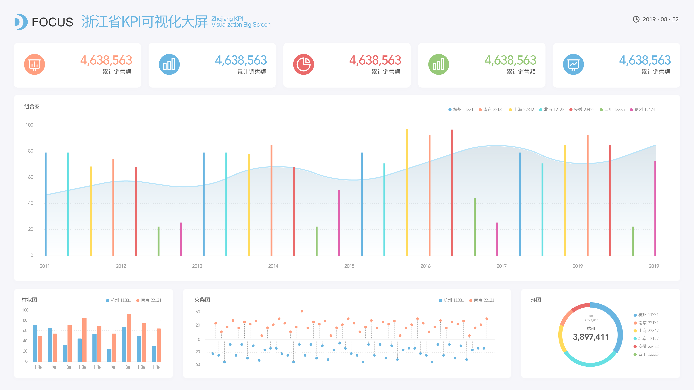

在这个大数据时代，因为数字化交易的不断普及，原本“实体”的客户不断的被数据化，并且有很多企业已经建立了自己的客户数据库，并且根据企业的实际，使用了不同的数据分析方法。比如聘请专门的数据分析师或是购买诸如DataFocus、数据赢家等智能数据分析工具。我们以前介绍过如何分析和处理客户数据，今天为各位分享从通用角度的客户细分思路。

我们可以将企业的所有客户数据分为8类，每一类客户都有其自身的特点，并处在相应的客户关系阶段中。企业可以利用客户价值细分结果实施相应的客户保持策略，进行企业资源的优化配置，从而实现企业利益的最大化。下面针对每类客户的特点进行相应的客户保持策略研究。

(1)第一类客户。其特点是当前价值、潜在价值以及客户忠诚都高，已将其当前业务几乎100％地给了本公司，而且本身发展潜力巨大。这类客户是企业的顶级客户，是企业收入的重要来源，如果失去他们对企业的影响很大，因此企业需要将最主要资源投入到保持和发展与这些客户的关系上，对每个客户设计和实施一对一的客户保持策略。

(2)第二类客户。其特点是拥有高的当前价值和客户忠诚、低的潜在价值，他们已将其业务几乎100％地给了本公司，积极地为本公司推荐新客户，但是他们在为企业增加利润方面已没有多少潜力可供进一步挖掘。这类客户对企业十分重要，因此企业应投入足够的资源，维持现有关系状态。

(3)第三类客户。其特点是拥有高的客户忠诚、低的当前价值及潜在价值，他们可能曾经为企业带来了巨大收益，但在潜力挖掘方面已经非常的弱。企业本应放弃这部分客户以减少成本，可对这部分客户采取默认的客户策略，在资源配置方面对他们投入很少的资源，甚至不投入。

(4)第四类客户。其特点是拥有高的客户忠诚及潜在价值、低的当前价值，客户对企业的产品、服务比较满意，建立了一定的客户忠诚，未来在增量销售、交叉销售等方面有巨大潜力。对这类客户企业应该加大资源投入力度，推动客户关系尽快进入稳定期，扩大客户业务总量。

(5)第五类客户。其特点是拥有高的当前价值及潜在价值、低的客户忠诚，对是否与企业继续合作持保留态度。对这类客户企业应当大量投入资源向他们提供超期望价值，以有效的提高客户满意度，推动客户关系进入稳定期，从而使之向第一类客户转换。

(6)第六类客户。其特点是拥有高的当前价值、低的客户忠诚及潜在价值，与企业的关系薄弱，但他们短期购买量较大，对企业利润有一定的贡献。对这类客户企业维持现状即可。

(7)第七类客户。其特点是拥有高的增值潜力、低的客户忠诚及当前价值，该类客户有很高的增值潜力，对这类客户企业应当投入适当资源，旨在促进客户关系向高级阶段发展。

(8)第八类客户。其特点是当前价值、增值潜力和客户忠诚都低。他们是最没有吸引力的一类客户，在当前及将来都不具备赢利的可能，对这类客户企业不需要投入任何资源，甚至可采取措施解除与其的关系。
