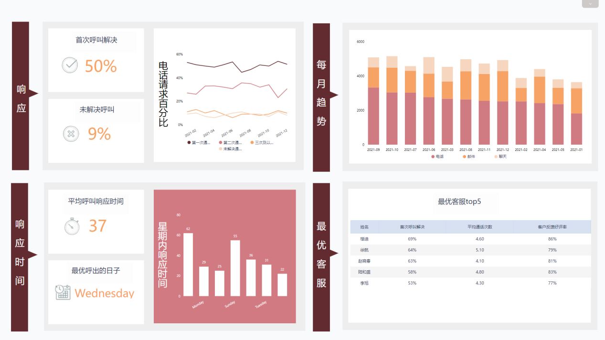
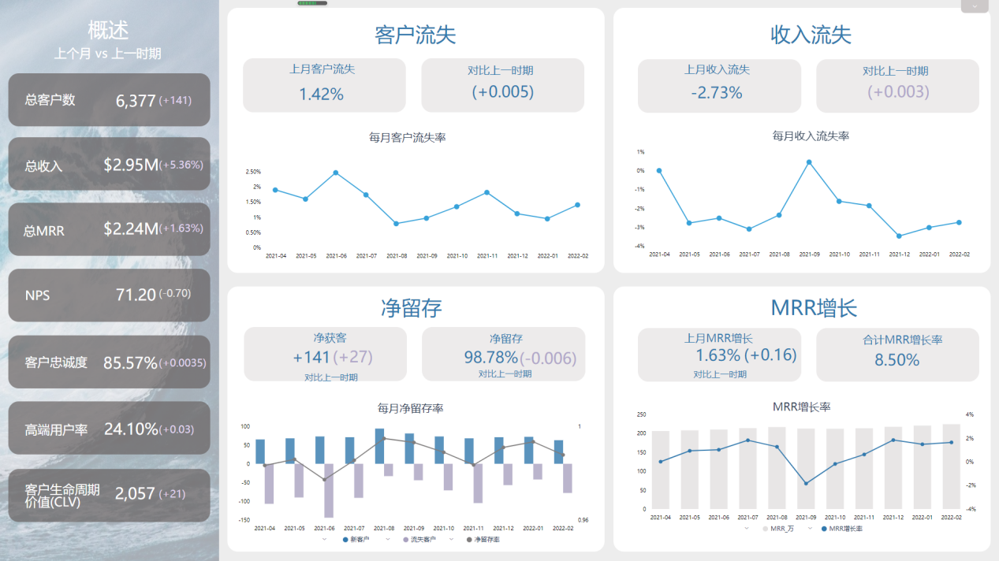

## 客户服务体系的制胜秘笈

客户服务大屏是一种现代解决方案，可通过简单易操作的方式监控所有客户相关的KPI。它同时与客户支持员工、客户服务经理和C级主管相关，有助于生成360度客户视图并提高服务团队绩效。海底捞火锅就是典型的以服务取胜的成功案例。

客户服务经理、专业人员和客户支持员工已经发展成为数据驱动型员工，他们需要监控和评估客户服务KPI并定期生成洞察力，以改善与客户的关系并确保业务增长。在现代客户分析软件的帮助下，团队将能够执行基本和高级分析，从现场生成的信息中学习，并创建专注于关键指标的现代客户服务报告，以确保准确的数据分析，并为您的业务带来最佳结果。

接下来，我们将展示针对部门内各种功能的4个客户服务大屏示例：

## **客户团队服务大屏**

客户服务直接面向客户，是公司对外沟通的桥梁，客服人员的服务质量对公司的形象起着重要的作用。然而客户的期望普遍会偏高，想要提供优异的、超出客户期望的客户服务十分困难，因此，可以借助专业的客户服务大屏的帮助，跟踪一些关键指标进行监测。例如，可以收集一些用户反馈来进一步提高客户团队的整体服务水平，反馈的内容可以是与产品相关，也可以是和客服人员相关。

从上图可以看到一个客户服务大屏，专注于团队每天和每月的绩效。大屏整体可以分为两个部分，每个部分分析他们工作的一个方面。左上角的第一个元素与解决方案有关：客户第一次电话联系客服人员时，解决了多少个电话？第二次、第三次解决了多少，还有多少仍未解决？跟踪这将使您了解您的团队在解决客户问题方面的效率。首次呼叫解决 (FCR)是一个非常重要的 KPI，因为它会给您的客户服务带来第一印象，当人们联系客户服务时，很可能他们遇到的问题已经浪费了一些时间，设法高效地回复他们的请求并解决他们的问题会给他们留下一个比较好的印象。这就是为什么这个指标需要保持越高越好。

另一个重要元素就是平均响应时间。等待的时间越长，人们就会越不耐烦，因此需要将其保持在较低水平。三分之一的客户会在等待一分钟后挂断，三分之二的客户会在3分钟后挂断。您可以在此客户服务大屏上看到一周中每天的平均响应时间。如果您想减少平均响应时间，您应该评估每天或每月收到的问题数量，提前计划并调整人员配备需求和时间表。

为了减少响应时间并提高FCR率，您可以做的是为您的客服提供良好的培训、共享脚本、客户调查和清晰的流程。还有一种方法可以节省大量时间，就是建立一个知识库，收集所有问题以及答案，让每个客服都可以查阅问题进行回复。

最后，为每个客服人员单独跟踪一定数量的指标：首次呼叫解决率、每小时平均呼叫次数、客户反馈……这将帮助衡量他们的效率和成功率，并找出谁打算成为经理，谁可能需要更多的培训。

## **客户满意度大屏**

客户满意度仍然是当今企业的重中之重。无数研究表明，轻松获取信息和客服支持会让人们爱上一个品牌，如果他们知道自己将拥有可靠的客户体验，他们通常愿意支付更多费用。一些指标在衡量公司客户服务效率中起着至关重要的作用，而另一些指标则更多地评估品牌是否采用以客户为中心的方法。我们的第二个客户大屏检查的是第二种类型的指标。

如上图所示，这个客户满意度大屏首先显示净推荐值 (NPS)。该 KPI 通过简单地一个问题来评估您推荐的力度：“从1到10，您向朋友推荐我们的可能性有多大？”。收集数据后，将这些数字分成三组：从0到6归类为不推荐者；7或8为被动者，而推荐者给了9或10。然后，简单地用不推荐者的百分比减去推断推荐者的百分比，你就会得到你的NPS分数。这将使您了解客户如何互动并看到您的品牌。为了更好地了解您的分数，您还可以将其与竞争对手的分数进行比较。拥有良好的NPS分数表明良好的客户忠诚度，并且与业务增长高度相关。

同样的，客户努力得分提出了一个简单的问题，可以提供有关客户体验的见解。事实上，了解您的客户在寻求帮助方面付出了多少努力是衡量服务质量的重要指标。

上面分析的两个指标都直接影响客户满意度大屏上的第二个 KPI：客户留存率。众所周知，忠诚度在企业成功中起着重要作用：拥有积极体验的人在第一次购买后会再次光顾，并且很可能会再次光顾，而且还会推荐您的品牌。此外，留住客户比从头开始整个获取渠道并尝试获取新客户要便宜。您在这里节省的成本可以重新投资于更需要的渠道，例如人员过多的支持团队，其对电话或电子邮件的平均响应时间与不满意的客户数量同步增长。设定目标保留率以达到并实施措施来实现它。

**客户支持 KPI 大屏**

无论您在客户支持中的角色是什么——客服人员、经理或副总裁，定期检查您的客户支持大屏将帮助您更好地完成工作。通过跟踪特定的绩效指标，您可以确定自己的优势和劣势、各种机会和改进空间。

客户支持大屏相比上面两个大屏，相对密集，它是一组KPI的混合体，适用于需要一目了然地了解其服务的管理人员。顶部的前两个指标提供了将在下面详细说明的数据：产生的总收入和成本占收入的平均百分比。

衡量与收入相比的成本百分比可以让您了解，相对于您产生的收入而言，您对支持团队的投资有多少。投资客户支持当然是一件好事，因为会产生更高的客户留存率。观察它如何随着时间的推移而发展也是另一种判断您是否将资金投资于正确部门的方法：无缘无故地为支持团队配备过多的人员会增加运营成本，并且不会带来良好的投资回报。您可以衡量的一个相关指标是随时间推移的每次支持成本：在您设定目标后（如上一年衡量的平均成本），如果您目睹了异常增长，是时候调查原因了.

这些成本直接受到支持仪表板上显示的右下角指标的影响：解决问题的平均时间。花费的时间越长，解决的问题就越少，贵公司的成本就越高。不用说，这也会影响我们之前看到的平均响应时间，这意味着您的声誉可能会受到影响。

最后，这是每个企业的目标，客户支持大屏展示了所有KPI中最重要的：客户满意度。您可以在通话结束、电子邮件交换或直接在应用程序上通过简单、简短的问卷调查来衡量它，以评估您在客户眼中的支持服务质量。当客户认识到品牌所做的努力时，他们的忠诚度就会随之而来，可持续的业务增长也是如此。

**客户留存大屏**

客户保留是现代成功企业的支柱，尤其是那些希望通过获取新客户来节省资源的企业，这通常比客户留存要昂贵得多。为了有效监控所有点点滴滴的数据并根据商业规律优化您的策略，客户留存大屏将有所帮助。

强调一句，此仪表板将重点放在 SaaS 业务上，但您可以根据自己的具体情况进行调整。在仪表板左侧，可以清楚地看到 NPS、忠诚客户率、高级用户百分比和 CLV。其次这个客户留存大屏的中心部分，我们可以看到客户流失和收入流失的详细信息。在这种情况下，客户流失显示了上个月流失情况的概览，然后借助折线图，表示了较长时期内的发展。我们可以看到，接下来几个月造成的流失率高于其他月份，这随后也影响了右侧的收入流失率。

客户留存大屏的下半部分侧重于净留存率和MRR增长。从图上可以直观的看到上个月的情况和上一时期的比较，还描述了净留存率随一段时间的变化趋势，借此，可以直观的发现流失和留存客户的数量，这些计算仅包括取消，因此您可以清楚地了解有多少客户决定终止合作伙伴关系并从中学习以在未来改进。

最后，MRR 增长显然是该仪表板中最重要的部分之一，它将这个数据故事与订阅模型中重复组件的数量相结合。在这种情况下，将净MRR、新MRR、扩张和流失MRR包括在内以获取详细的增长并生成完整的图片是有意义的。

现在轮到您将我们的客户满意度大屏作为样例模板，创建属于您自己的与客户相关的满意度大屏。无论您是普通小职员还是数据分析专家，都可以利用DataFocus14天的免费试用期实现您的客户满意度大屏~
