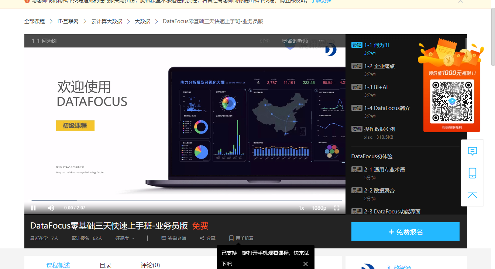
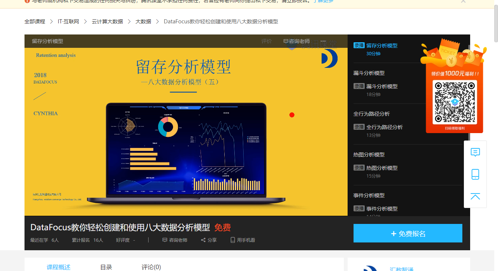

对于新零售行业来说，无论是线上店铺还是线下实体店，活动的策划和举办是必不可少的，是吸引新客、维护老客并让老客变为忠实粉丝的一大利器。电商崇尚“折腾”，按一定频次地“霸占”客户的眼球和时间，并通过一定的优惠手段及积分等项目让自己的客户群体更加的有活力。很多商家都会以数据分析的结果去赋能下一次活动，无论是聘用专门的数据分析师还是使用类似于DataFocus、Power BI等自用数据分析工具。

而活动非常重要的一环就是预热。我们以前的文章提到过很多次“闭环”的概念，所以，活动预热也绝不是“一次性”买卖，预热并不仅仅是为活动本身造势，更是为店铺的数据库增加新的血液，添加新的优质客户数据以便可持续发展性的做营销和维护工作。

那么合适的活动预热渠道就非常重要，好的渠道能够方便、快捷、可触达的采集到优质数据。我们以春季新风尚活动为例，结合我们合作商家的实际在微博的做法，这里主要介绍微博视频和微博话题。

首先为什么最先会选择微博话题这个渠道来做预热数据的采集。因为微博作为国内年轻人聚集的几个社交平台之一，正好可以满足整个活动增加年轻客群数量的目的。比如创建一个超级话题，微博用户可以直接在话题内进行讨论与互动，同时还可以进行话题主持人的申请，成为主持人，在成为店铺会员后，会直接将会员等级提升一级。这些都是一手的良性数据。

此外，还可以将话题推向微博热搜榜，微博热搜榜是目前微博流量入口最大的几个地方之一，而且是官方的资源，并不需要额外的花费，话题进入热搜榜后，就会吸引更多的人进入，从而形成良性循环。而对于微博视频这个玩法，如果想要吸引更多的人点开视频进行观看，还能在视频内设置红包抽奖，吸引更多的点击，从而获取更多的曝光，并采集到更多的潜在客户数据和反馈数据。
