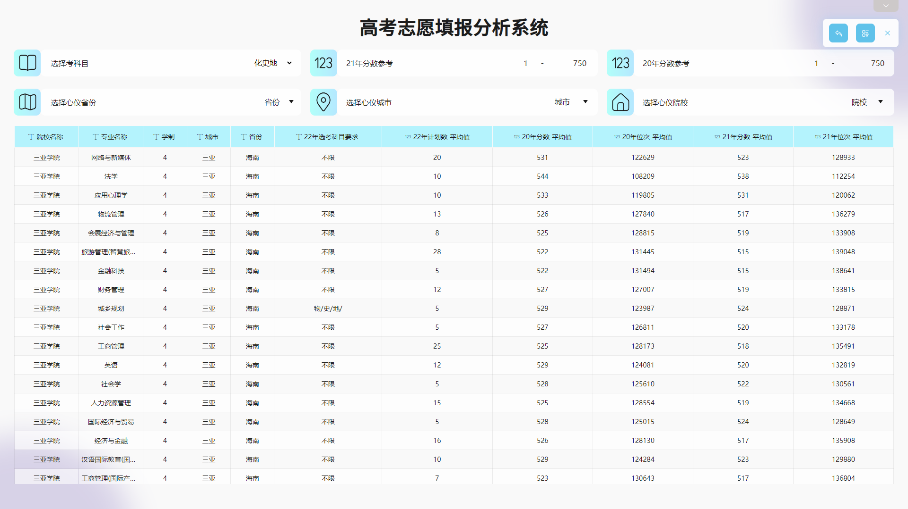

**免费的高考志愿填报分析系统，志愿辅导必备！**

高考对于每位学生来说都是人生重要的一步，而选择适合自己的大学专业则是这一步中的关键。随着高考改革的不断深化，填报志愿的方式也在不断演变，考生和家长们需要面对更多元化、更复杂的选择。

2023新高考志愿填报院校方案汇总已经公布。根据方案内容，浙江采取“专业(类+院校)”方式。相较此前传统填报，新高考填报方案下考生拥有更多元化的选择。然而，新高考志愿填报方案在赋予考生更多元、更灵活选择的同时，也带来了一定的志愿填报难度。以“专业(类)+院校”为单位的浙江，普通类分别最多可以填报96个志愿和112个志愿。这对缺乏相关经验的考生及家长是一个不小难题。

浙江省当前实行7选3模式，由学生自主在物理、化学、生物、政治、历史、地理以及技术中选科3门作为高考的考核科目，自然就产生了35种选科组合，而所选科目又直接与能够报考的专业挂钩，进一步提高了报考的难度系数。

在这个关键时刻，一款智能的志愿筛选系统成为了考生们的得力助手，帮助他们更轻松地制定合理的填报方案。

**根据选科组合和分数，实现智能筛选**

图1 志愿填报罗盘

这套系统支持在筛选框中选择学生的选考科目组合类型**（35种选科组合已设置完成）**，并填入分数范围，就可以筛选出可报的专业列表，还可以进一步添加条件，如省份、城市、院校，从而更精准匹配自己的需求。比如有个考生在7门科目中选择了化学、历史和技术（化史技），并且预估自己的分数在620到650之间，那么就可以在这套系统中选择相应的科目并对比2020年以及2021年的分数参考进行筛选。除此之外，假如该考生想去浙江上大学，或者对宁波大学感兴趣也可以直接筛选。

<iframe src="https://bbs.datafocus.ai/storage/article/20230614/beb1cbb12a2c3fa6f690bcfe1074df1e.mp4" frameborder="0" allowfullscreen="allowfullscreen" data-mce-fragment="1"></iframe>

GIF图2 筛选信息

**同时**筛选结果支持按照升序或者降序排列，只需点击相应表头内容即可排序。比如按照2021年的分数进行升降序排列。

<iframe src="https://bbs.datafocus.ai/storage/article/20230614/cbe0ff788222e6f2e859f86b874a0e66.mp4" frameborder="0" allowfullscreen="allowfullscreen" data-mce-fragment="1"></iframe>

GIF图3 升降序

**如何获取并使用这样一个简单灵活的志愿填报系统呢？**

您可以直接通过链接进入到筛选系统中，直接开始筛选心仪院校。

用工具提升效率，帮助学生更好地完成志愿填报工作，匹配心仪志愿。

十年寒窗苦读，3天考试定乾坤。既然已经考过了，能得多少分已经没法改变。但是，距离考生们的成功之路还有最后一步，那就是志愿填报了。如果说考多少分完全靠实力，那么填报志愿倒是多少有点儿运气的成分。还记得几年前的重庆大学吗，有多少幸运儿抓住了机会，仅仅过了一本线就能读上知名985大学啊。所以说志愿填报，实力之外还有那么一点点儿小运气。有个热心的DataFocus用户根据过往几年的高考录取分数，制作了这个高考志愿填报分析系统，希望能给广大考生家长助力最后一公里，让高考的每1分都能发挥最大价值。

高考志愿填报系统免费给考生家长开放，为了保证体验，系统采用邀请使用的方式（如果完全开放链接系统可能承受不了），有需要的家长请添加微信索取链接。还没有高考的朋友可以分享一下，说不定你身边就有需要的人，举手之劳哦。

**关于DataFocus：**

DataFocus是第一个中文搜索式智能数据分析系统，始终致力于让大数据分析像搜索一样简单，让每个人都能通过搜索探索数据价值。

