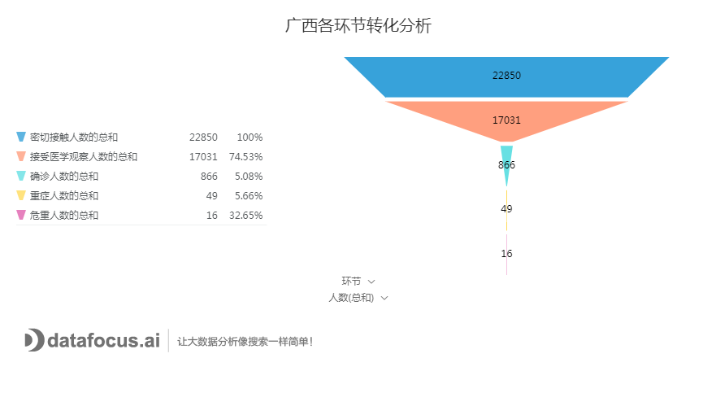

此次新型冠状病毒传染极强，短短一个星期就遍布了中国整个地图，各省市纷纷启动“I级”响应，广西也同样于1月24日开始启动重大突发公共卫生事件一级响应。今天，我们就来分析一下这个作为全国少数民族人口最多的省区——广西 的新型肺炎疫情概况，希望能为广西防疫提供一些新思路。

1. 全省及各市疫情概览

从下图我们可以看出，广西确诊人数日增量在1月29日达到一个峰值。但值得注意的是广西并未像其他省份的峰值比较明显，确诊的日增量整体成持续波动状态，并无明显的下降或者上升趋势。这说明目前广西的疫情形势还是比较严峻，疫情防控不能松懈。

接下来我们看看广西近日确诊人数的增长率，斜率从陡峭转为平缓，并持续在10%左右。但是跟距离湖北更近受到疫情影响更重的四川相比，这个增长率的趋势还是不容乐观，但值得我们欣喜的是，2月4日，广西省政府发布最新疫情防控指令：禁止公众聚会和集中展销，并暂时关闭部分公共场所，相信这一举措应该更有助于减缓确诊人数的增长。

截止2月4日24时，广西全区累积确诊病例150例，各市确诊人数分布如下图，其中北海和南宁人数最多，分别为29人和28人。南宁市作为省会城市，确诊人数较多是比较正常的，那为什么远在广西南侧的北海市也如此严重呢？我们追溯广西疫情发展的时间线发现，早在1月19日，北海市就发现1名来自武汉的游客出现发热等症状，而新型肺炎从1月20日以后才开始逐渐被全国人民重视，从而导致了北海成为广西目前确诊人数最高的城市。值得庆幸的是，目前崇左市和来宾市还未发现首例确诊病例，希望这两个城市加强防护，继续保持！

为了进一步分析各市的疫情情况，我们来看一下广西各市确诊人数的日增长量。从下图折线图中可以看到各市的日增量波动幅度还是比较大，其中北海市在1月30日之前的日增长量还比较小，但是在1月31日北海却突然激增

1. 重症率分析

广西从1月26日起开始出现第一例重症新冠状病毒至今，平均重症率为6.6%，即100个确诊病人中大致出现6-7个重症患者。而且从图中可以看出重症率有稳定下降的趋势，但是广西的新型肺炎定点收治医院仅有19家，随着时间的发展，医疗资源将会逐渐紧张，在此希望广西市民不要过分恐慌，从而浪费有限的医疗资源。

1. 各环节转化分析

最后，统计了广西全区各环节统计人数的占比情况。从漏斗图中可以看到**从重症到危重转化率高达32.65%**，这进一步说明广西的医疗资源有限，仍需加强各县市医院的综合救治能力。

据小编了解，广西大数据发展局通过集成数据，包括手机号码、航班、骑车、宾馆、高速公路等数据综合做分析，通过追踪已确诊病人的录井轨迹，及时精确的圈出可能被感染的人群，所以从上图我们可以看出接受医学观察人数相对其他省份较高，突破了一万。同时也进一步说明“自我隔离”，少出行，不聚众依旧是防控的重要措施。在大数据时代，数据能挖掘事件规律和趋势，从而正确引导群众。

“科学防控”，我们在路上。
