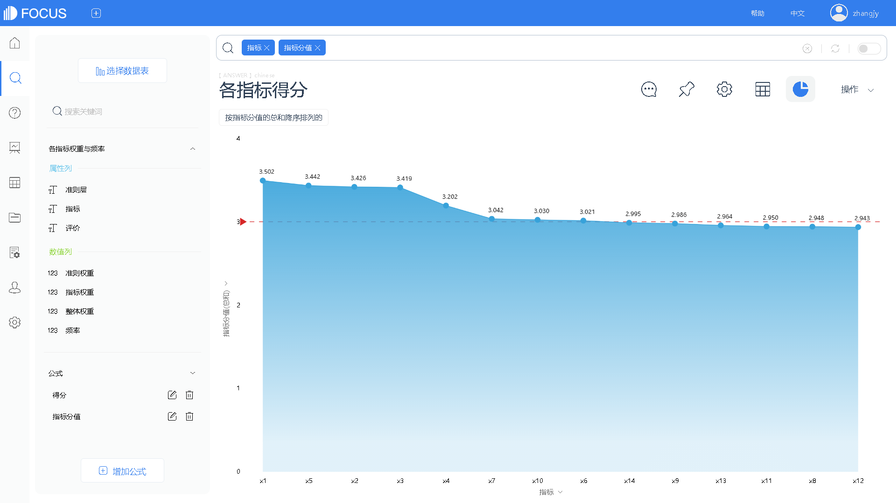
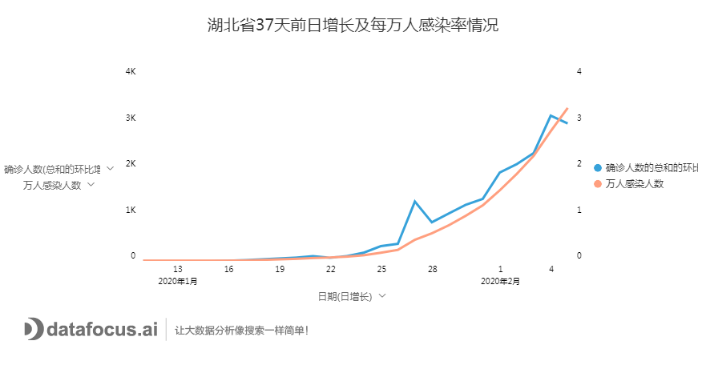

两个月前，一种来历不明的病毒在武汉迅速蔓延，并用短短7天的时间覆盖了整个中国。截至到今天下午15点，全国感染新冠肺炎的患者累计高达81026例，累计死亡病例3194例。3月12日，全国新增确诊病例首次降至个位数，这是中国倾举国之力，耗费无数资源迎来的转折性变化。虽说中国对此次疫情已经有了一定的控制，但在中国以外的地区，正在重复上演着相同的悲剧。

世界卫生组织13日的数据公布显示，中国以外新冠肺炎确诊病例已经超过50000例，死亡病例超1700例。其中意大利、伊朗、韩国、西班牙成为疫情最严重的国家。同时，美国新冠肺炎疫情同样令人不安，未来是否会像韩国、伊朗和意大利那样出现急速上升的状况，我们不得而知。

基于这种情况，我们将先前投注在国内的目光拓展到全球，揭秘海外的新冠病毒疫情现状，以及未来可能会如何发展。

我们先来简单了解一下此次数据分析所用到的数据表。此次选用的数据有两份，一份是全球的疫情数据，另一份是湖北省的疫情数据，主要用作对比。数据来源于国家卫健委、世界卫生组织以及湖北省卫生健康委员会官方通报文件，人口数来源于国家统计局。通过此次分析，我们将从疫情现状出发，了解疫情的整体发展趋势和规律，希望能为此次疫情的结束尽一点绵薄之力。

1、全球疫情分布

了解数据结构后，就需要整理数据分析的思路。

首先我们需要对疫情的全球分布情况有一定的了解，因此利用地图对此次疫情波及到的区域进行划分，用颜色的深浅代表各地区确诊人数的状况。

从这张疫情地图中我们可以看到，除了此次病毒的爆发地——中国，意大利、韩国、伊朗、法国、西班牙的疫情现状也不容乐观，其中意大利为海外国家中首个确诊破万的国家，伊朗紧随以后。

除了非洲的一些国家以及格陵兰等，日前共计124个国家已有确诊病毒案例。、

2、海内外概览总计

查看完全球疫情分布地图后，下一步我们对你中国和海外的疫情重要指标，即对比海内外确诊人数和死亡人数。因为是指标类的对比，我们直接选择最简洁的KPI图形。

这里我们以中国确诊人数的图表为例，截至到2020年3月13日晚24点，中国国内累计确诊人数为80824例（不包含港澳台），死亡病例3189例，海外确诊病例数为51767例，死亡1775例。我们可以看到，国外确诊人数已逼近中国的7成，死亡人数累积也已经超过中国的1/2。

3、各国病亡率

在了解全球疫情现状的基本指标后，我们来计算一个大家非常关注的值——病亡率，也就是我们常说的死亡率。病亡率其实就是利用死亡人数除以确诊人数，但它与此次疫情的严重程度息息相关，以新冠肺炎的传染率若再加上较高的死亡率，那么此次疫情无疑会成为全球的一场大灾难。

这里我们筛除确诊人数较低导致的高死亡率，直接选择确诊人数较多的国家进行对比。世卫组织计算得出的全球死亡率在3%至4%之间，从柱状图中，我们可以看到意大利的死亡率已经大于世界平均水平，高出告警阈值，达到了异常的6%。

这里我们主要分析导致上述现象发生可能的三个原因。第一，意大利的人口老龄化比较严重。基于对国内数据的研究，我们可以知道，此次疫情影响较大的是中老年人，因为老年人的身体基础较差，容易患有各种疾病，身体抵抗力弱。意大利的老龄化情况导致了此次疫情出现了较高的死亡率。第二，医院现有资源不足。众所周知，意大利以其完善的医疗体系闻名世界，那么为什么会出现医院资源不足的情况呢？这其实是现代西方医疗体系中一个非常严重的BUG，在意大利，你看病需要提前进行预约，如果你是“小毛病”，那么你的预约可能会排到4-5天后，这真好给了此次新冠肺炎“可乘之机”。等到患者确诊为新冠肺炎，他可能已经接触了成百上千人。等到疫情大面积爆发，就一定会出现医疗资源紧张的局面。第三，对疫情不重视，检测不到位。以我们对西方人的了解，他们认为，只有生病的人才会需要佩戴口罩，健康人是不会佩戴口罩的，因此他们的防范意识薄弱，而口罩，中国人都知道是防范此次疫情最有效的方法。

病死率位居第二的就是中国，此次疫情的爆发地，死亡率偏高也算正常，其后一次为伊朗和美国。说到美国，其实很多朋友都知道，美国实际感染人数一定是大于现有报告人数，因为此前美国爆发的流感，导致美国对新冠肺炎的监测并不到位，很多新冠肺炎患者被当做流感对待，这一定会导致美国新冠肺炎确诊人数的暴增。

4、国外确诊前10

接下来我们将重点研究此次疫情的“重症”地区，先来查看一下确诊人数排名前10的海外国家，因为中国的疫情已经得到了有效控制，这里我们剔除中国，直接了解海外国家。

从柱状图中，我们可以看到，截止目前，意大利的确诊人数为15113人，伊朗确诊人数为10075人，韩国确诊人数为7979人，西班牙超越法国位列第四为2965人。从柱状图的高度差异中，可以看到排名前三的国家确诊人数已达第四名西班牙的3倍！

我们还可以知道现今疫情最严重的一定是欧洲地区，海外疫情排名前10的，欧洲地区占了一半。

5、“重灾”地区疫情现状

从上述的柱状图中，我们可以看到，疫情最为严重的海外国家分别是意大利、伊朗、韩国，因此我们就目前这三个“重灾”国家的数据来了解其确诊人数的增长趋势及每万人感染率情况。

首先是日增长趋势，也就是说比前一天增加的确诊人数，即新增确诊人数。这里筛选近20天的数据，从折线图中我们可以看到，意大利的日增长趋势很快，伊朗也正处于疫情上升期，韩国因为有效的防控手段，日增长已经得到了控制。

接下来是万人感染情况，我们收集了这三个国家的人口数据，然后对万人感染率进行了计算。从折线图中我们可以看到，在3月10日，意大利取代韩国，霸占了“重灾”地区的感染率第一名，并且感染率趋势仍在上升。

6、用湖北数据反推世界

湖北之于中国，就好比重灾国家之于世界。因此我们将湖北省的日增长及每万人感染情况和这三个国家来做个简单的对比。

国家统计局2019年数据显示，湖北省2019常住人口约为5917万人；而意大利同年人口为6048.2万人，韩国为5126.9万人，规模和湖北相当，再加上确诊人数较多的伊朗，将疫情重灾区与湖北省前期疫情进行比较，两者爆发时间大致相差35天左右，我们这边选用湖北省前37天的数据。

因为使用的是两份数据，我们这里可以将两张图表放置到数据看板中进行对比。

对比上图，我们可以看到湖北37日前的日增长趋势与意大利走向十分吻合，“每万人确诊数”发展轨迹和湖北也几乎一致。

7、各环节转化

最后附上一张湖北省各环节转化的漏斗图，了解一下从密切接触到确诊到死亡，从初期排查工作到确诊工作到治疗工作，他们之间的转化占比情况。

这是湖北省的转化情况，类推其他国家，如果存在确诊率低，死亡率较高的国家，就需要认真排查密切接触者了！

中国疫情能这么快得到控制，除了全国人民的支持和政府的控制，还归功于全国各地汇集而来的援鄂力量。但身处欧盟的意大利，几乎处于“孤军奋战”的情况。中国在抗击疫情的同时也向意大利伸出援助之手，一带一路的纽带比以往任何时候都更加强大，援意专家组以及相关物资已经抵达意大利，在这里希望我们的白衣天使们做好防护，期待你们的凯旋！

进行到这里，此次的疫情分析也就基本结束了。

总结此次分析，我们可以知道美国、欧洲的实际感染人数一定是大于现有报告人数，一些中小型的国家也可能会面临医疗资源耗尽的局面。未来一个月，如果欧美地区仍然实行鸵鸟政策，确诊人数可能会突破100万，死亡率也可能进一步提高。希望全球各国人们团结一致，共同度过此次难关。

最后进行一个大屏的展示。

微信搜索“datafoucs”关注公众号，回复进群，了解更多疫情分析相关内容。
