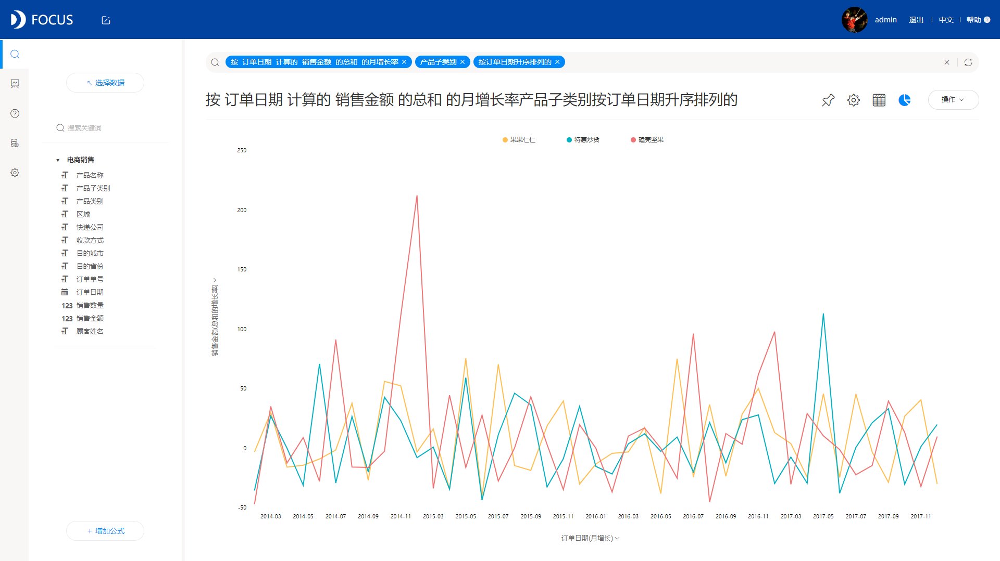
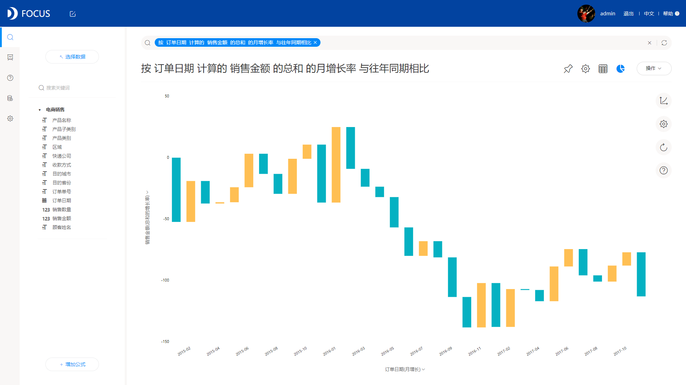

**搜索式分析—未来数据分析的潮流**

现如今，数据分析十分火爆，人人都想进入数据分析领域。而随着这股潮流，众多数据分析工具应运而生，这些数据分析工具大多有一个特点，支持数据清洗，快速分析，可视化并分享信息，而且交互方式清一色地采用拖拽式。但是，在所有工具都采用拖拽式进行数据分析时，有这么一款数据分析工具，不随波逐流，偏偏要创造属于自己的特色，故搜索式分析就这么诞生了。

DataFocus，一款搜索式分析工具，国内首个采用自然语言进行搜索分析的工具，它使数据分析变得像谷歌搜索一样简单。DataFocus有一个搜索框，若是想要查找分析某些数据信息，可以直接在搜索框内输入关键字段，或者关键句式，系统会实时地返回结果，并以最合适的图形来展示。例如，我现在想要分析各产品类型的销售环比，在DataFocus中，可以直接输入环比相关的关键句式：按 订单日期 计算的 销售金额 的总和 的月增长率　产品子类别，效果如下：

搜索式分析的优势在哪里？有没有想过当需要分析的列或者字段过多，拖拽的弊端就显现了，而且拖拽需要用户判断设定Ｘ轴Ｙ轴图例等，而搜索式分析，只需要把所有的字段或者列，双击或者手动输入到搜索框内，系统后台会自行配置设定哪些适合为Ｘ轴，哪些适合为Ｙ轴，哪些适合为图例，不需要用户过多的操作。

我敢说，未来数年内，这种搜索式分析会越来越多，终将代替拖拽式成为主流。

