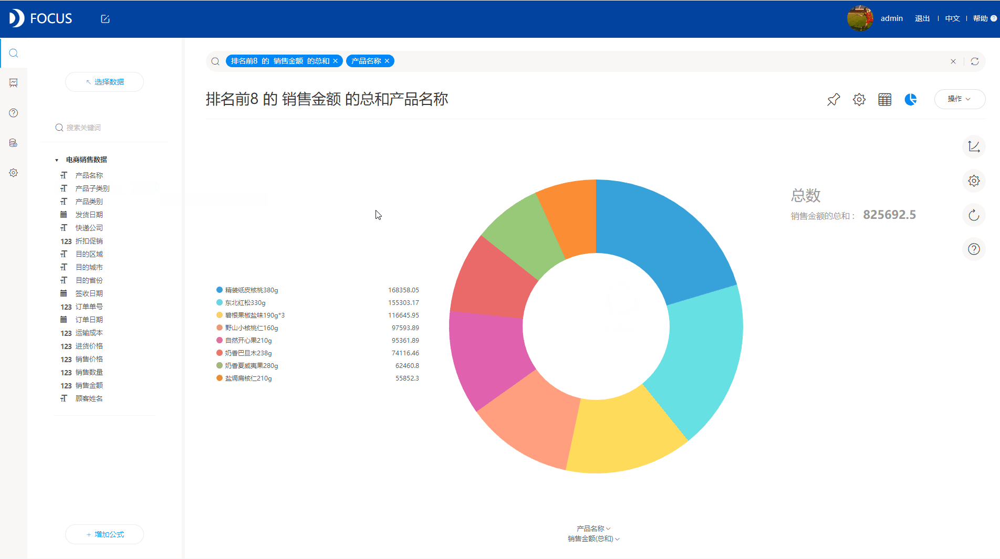

现如今进入大数据时代，各行各业都开始利用大数据赋能企业的运营和决策。应对这一趋势，很多做大数据分析软件或服务的企业应运而生。他们利用软件或是项目式服务，让企业的大数据不再是冰冷的字母和数字，让其成为能够变成决策辅助的信息化模型、可视化图表等。项目式的数据分析企业比较著名的有用友、金蝶等，产品软件式的数据分析软件比较著名有DataFocus、Power BI等。而对于大多数TO B数据分析软件或服务的企业来说，面临的很大问题就是项目周期长、需求多变、开发进度慢等。随着敏捷开发的不断兴起，大数据分析软件也迅速的顺应了时代潮流，比如早期的推拽式分析（Tableau等）和最近的搜索式分析（DataFocus等）。

首先可能很多人不是很明白为什么很多靠定制化开发的数据分析项目非常难做。下图可以非常清楚地描述个中原委。

因此，对于提供大数据分析服务的乙方来说，“天天变”“经常改”是常态，也造成了很多资源和时间的浪费。这就是敏捷开发要解决的问题。

传统的定制化大数据分析项目就像一个瀑布，它可能越滚越大，风险也越来越大，交付成疑。敏捷开发就像把大数据分析项目按照“一口”的大小能让甲方一口口吃掉，逐步交付。并且第一次迭代就可交付能工作的版本，风险发现的也早。因此，敏捷开发是一种以人为核心、迭代、循序渐进的开发方法。

所以，最好的敏捷开发，就是让迭代和循序渐进最小化。也就是说能够让项目甲方直接可以使用的并且迭代和修改成本极低的方式。对于大数据分析来说，就是搜索式分析。何为搜索式分析，我们以DataFocus为例，简单的理解为输入想要搜索的关键词，点击搜索，即可像百度一样秒内出你需要的结果，甚至是可视化图表。

所以，它满足对于大数据分析项目来说最好的敏捷开发样式。能够最快的交付可实际使用的版本，或者说第一时间就可交付最终版本，即使改变需求，改变搜索的关键词即可。乙方也不用天天在甲方处驻点或是经常性维护，大大节省了成本。
