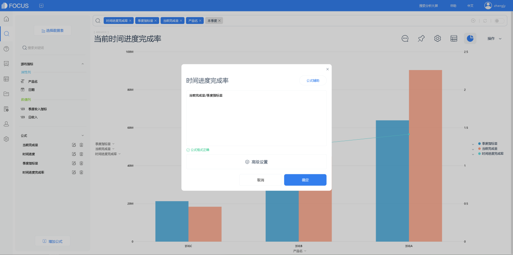

不同的数据分析师可以解释相同的数据。结论可能不同甚至相反，但结论不对或错，所以从客观数据到主观人都需要有一些科学的分析方法作为桥梁，帮助数据信息更好，更全面，更快。那么，产品常用的数据分析方法是什么？今天我们将通过数据分析工具DataFocus与大家讨论！

1. 趋势分析  
    趋势分析通常用于核心指标的长期跟踪，例如：点击率，GMV，活跃用户。通常，会生成一个简单的数据趋势图，但不光要会分析趋势图，还有必要观察数据的未来趋势变化，是否存在周期性，是否存在拐点，以及分析背后的原因，是否是内部原因也是外部原因。趋势分析的最佳输出是比率。有介质，年份和基础比率。 
2. 对比分析  
    水平对比：水平对比是与自身进行比较。最常见的数据指标是需要与目标值进行比较以回答我们是否已完成目标，比如：与上个月相比，销售额增长了多少。

  
垂直比较：简单来说，它与其他进行比较。我们必须与竞争对手进行比较，以回答我们在市场中的份额和地位。

  
常见的比较应用是A/B测试。 A/B测试的关键是确保两组中只有一个变量，其他条件是一致的。例如，要测试不同渠道的投放效果，您需要确保产品相同，投放投入相同，并且在线时间保持不变，测试的数据才是有意义的。

1. 象限分析  
    根据不同的数据，每个比较主题分为四个象限。  
    通常，产品的注册用户由第三方渠道提供。如果可以将流量源的质量和数量划分为四个象限，则选择固定时间点来比较每个信道的流量成本。质量可以通过该维度的总量来保留。作为标准。对于高质量和大批量的渠道继续保持，为优质低容量渠道扩大引进数量，低质量小批量传递，低质量和大批量尝试投入策略和要求，这种象限分析使我们能够进行比较和分析获得非常直观和快速的结果。

1. 交叉分析  
    比较分析具有水平和垂直对比。如果您想同时要水平对比度和垂直对比度，则需要进行交叉分析。交叉分析方法是交叉检查来自多个维度的数据并执行多角度分析。  
    交叉分析的主要作用是细分来自多个维度的数据，并发现最相关的维度，以探索数据更改的原因。  
    常见尺寸为：  
    分时：数据是否在不同时间段内发生变化。  
    子信道：来自不同流量源的数据是否发生变化。  
    子用户：新注册用户与旧用户之间是否存在差异，高级用户与低级用户之间是否存在差异。  
    子区域：不同地区的数据是否会发生变化？  
    交叉分析是从粗到细的过程，也可以称为细分分析。  
    趋势，比较，象限和交叉点涵盖了数据分析的最基本部分。无论是数据验证，数据分析，发现趋势，进行比较，绘制象限和细分，数据都可以发挥应有的作用。我希望通过以上分享，您可以帮助数据分析师更好地分析数据，更多关于数据分析工具，请关注：DataFocus
