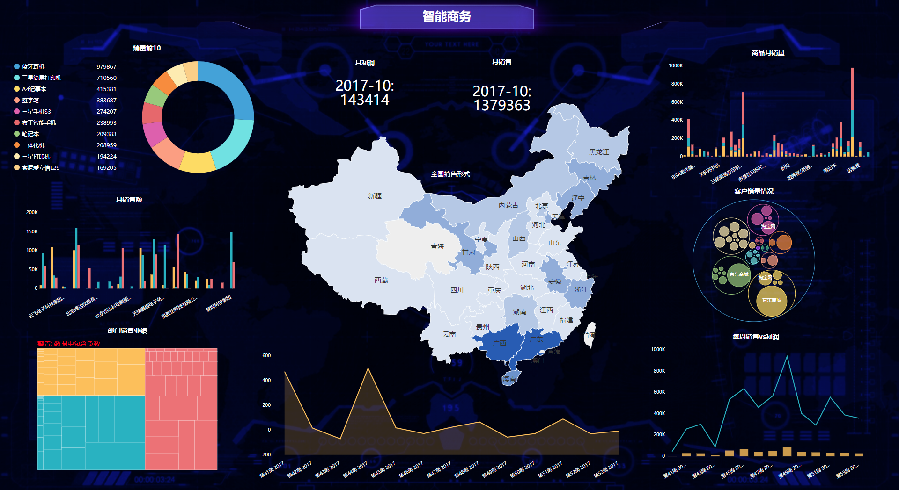

现如今进入大数据时代，很多企业都开始或多或少的利用大数据所产生的价值。对于企业来说，大数据能够起到的角色和分量因企业本身而异。但是有一点可以肯定的是，现今的决策者已不断在利用数据分析辅助决策，已达到让决策更精准的目的。并且也有很多企业组建了数据分析团队，比如很多电商企业就会频繁的利用数据报表来诊断店铺问题，亦或者有很多企业利用DataFocus、Power BI等基于AI的智能数据分析工具来辅助决策。但是也有很多企业在数据分析的实施上遇到问题，尤其是在分析团队和业务团队之间，似乎总有不可逾越的鸿沟，但其实，数据分析应作为一个项目，而不是一个单独存在的流程节点。

首先我们从数据角度来看看什么是项目。项目是为创造独特的产品、服务或成果而进行的临时性工作，是将数据、知识、技能、工具与技术应用于项目活动，以满足项目的要求。而项目经理是由执行组织委派，领导团队实现项目目标的个人。那么一个能成效的数据分析团队，就是能够切实让数据报表或结果为业务服务的，能指引路径的，并且应该投入所有相关的人员和资源，比如业务人员和数据分析人员共同成为一个项目组，项目经理如果有条件也应由最后的决策人承担。

那么一个成功的数据分析项目应具备什么标准，第一就是按时完成。很多电商企业的报表是不准时的，或者说数据已经过期，尤其是把报表交给一些服务商来做，就会大大增加沟通和协调所耗费的时间。第二是质量符合预期要求。比如说可视化，那么出来的数据结果应是符合标准的，比如要求是全国客户分布，那么出来的应是一个地图或饼图等。第三是成本控制在范围内。比如决策者再招两个数据专家的成本可能是每年40万，而购买一个BI工具的年费或许只要万把块钱。

所以，项目尤其自身的优势，所谓万事皆可项目化、万物皆可数据化，数据化和项目化一旦结合，便能发挥意想不到的价值。
