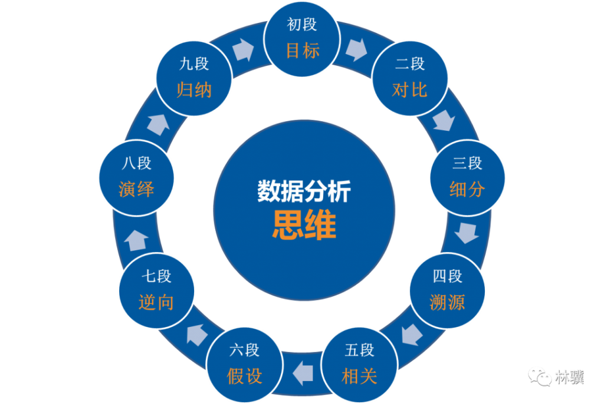

[数据分析](https://www.datafocus.ai)主要有哪些思维？学习的路线是怎么样的？

为了提供一个简单的方向指引，让数据分思维析的学习过程更加有趣，我做了一幅数据分析思维[九段路线图](https://www.datafocus.ai "九段路线图")，你可以把学习的过程当作一种游戏，享受段位升级的乐趣。

在段位升级的过程中，如果你理解起来感觉比较吃力，那么应该沉下心来，认真地先把基础打好，积累更多的数据分析经验。

### **1\. 初段：目标思维**

做数据分析，首先要一定明确目标，以终为始。

只有明确目标，才不会迷失方向，就像导航软件，如果没有设置目的地，那么它是没法告诉你路线图的。

目标思维主要体现在以下 3 个方面：

（1）正确地定义问题

比如说，小明听了煎饼大妈月入 3 万的故事，心里就想：为什么煎饼大妈月入 3 万？

这个问题的定义，应该是关注「月入 3 万」，而不是「煎饼大妈」。

也就是说，小明想的应该是「如何实现月入 3 万」，而不是「如何变成煎饼大妈」。

（2）合理地分解问题

比如说，煎饼大妈如何实现月收入 3 万？

这是一个比较大的问题，可以进行细分，因为收入等于订单数乘以客单价，所以把这个问题细分为两个小问题：

a. 如何实现一个月卖 5000 个煎饼？

b. 如何实现平均每个煎饼卖 6 块钱？

（3）抓住关键的问题

在不同的发展阶段，关键问题是不一样的。

比如说，对煎饼大妈来讲，刚开始做的时候，关键问题是：如何选择人流量大的好地段？

当选好地段之后，关键问题就变成：如何提高路人来购买的概率？如何提高客单价？如何提高重复购买率？

总之，数据分析的目标，就好比枪上的瞄准器，如果没有瞄准器，枪照样可以打，但是有了瞄准器，枪才可以打的更准。

### **2\. 二段：对比思维**

有人说：

> 没有对比，就没有伤害。

在数据分析中，没有对比，就没有结论。

比如说，小明某次期末考试的成绩不好，英语只得了 30 分，小明的妈妈对他说：“你上次考试英语考了 70 分，这次怎么就考得这么差？你看你的同班同学，这次都考 80 分以上。”

常见的对比思维有以下 5 种：

（1）跟目标对比

（2）跟上个月比

（3）跟去年同比

（4）分渠道对比

（5）跟同类对比

数据分析的过程，就是在明确目标之后，通过对比等思维，找到问题的原因，得出分析的结论，提出可行的建议，从而起到帮助决策和指导行动的作用。

### **3\. 三段：细分思维**

有人说：

> 不自由，毋宁死。

在数据分析中，细分是数据分析的灵魂，无细分，毋宁死。

比如说，小明某次考试的总成绩不好，细分一看，发现其他科目的成绩都不错，只有英语成绩特别差，只得了 30 分，从而拉低了整体的成绩。

常见的细分方法有以下 5 种：

（1）按时间细分

（2）按空间细分

（3）按过程细分

（4）按公式细分

（5）按模型细分

在运用细分思维解决问题的过程中，要做到有的放矢，围绕数据分析的目标，找到合适的方法，不要像无头苍蝇一样到处乱撞。

当发现数据异常时，尝试从不同的维度进行细分，这样既能锻炼你的数据分析思维，又能加深你对业务的理解。

### **4\. 四段：溯源思维**

做数据分析的时候，要多问几个为什么，追根溯源，在数据源寻找可能隐藏的逻辑关系和解决方案。

比如说，小明把自己每天的行动数据，都用 Excel 详细记录下来，其中包括每一时段的情绪数据。小明做复盘总结的时候，发现有一天情绪数据特别低，然后连续问了几个为什么：

（1）为什么这一天情绪数据特别低？

因为那一天小明上当受骗了。

（2）为什么会上当受骗？

因为骗子用生命安全来吓小明。

（3）为什么骗子能吓到小明？

因为小明担心自己的生命安全。

（4）为什么小明会担心生命安全？

因为求生是人类的本能反应。

（5）为什么人会有求生的本能？

因为人的大脑分为：年代久远的本能脑、相对古老的情绪脑和非常年轻的理智脑。

理智脑对大脑的控制能力很弱，大部分决策往往源于本能和情绪，而非理智。

到这一步，小明找到了自己上当受骗的根本原因，在于自己当时没有控制好自己的大脑，所以失去理智。

针对这个问题，小明运用「控制两分法」，并在脑海中反复进行演练，然后在实践中进行校正，实现与情绪的和平共处，从而更加理智地面对纷繁复杂的世界。

如果你经常运用溯源思维，就能提升数据的敏感度，并加深对业务的理解。

### **5\. 五段：相关思维**

相关思维，就是寻找变量之间相互关联的程度。

比如说，有一家超市的数据分析师发现，跟尿布一起购买最多的商品竟然是啤酒，啤酒和尿布有什么关联呢？

采访小明的爸爸，他说自己下班后，给小明的妹妹买尿布的同时，也会购买自己喜欢喝的啤酒。

如果一个变量改变的时候，另一个变量也朝着相同的方向发生变化，那么我们就说这两个变量之间存在正相关性。

运用相关思维，通常包括以下 3 个步骤：

（1）收集相关数据

（2）绘制散点图形

（3）计算相关系数

需要注意的是，相关不等于因果。即使两个变量之间相关，也不代表其中一个变量的改变，是由另一个变量的变化引起的。

比如说，国家的诺贝尔奖数量，与巧克力消费量之间呈现正相关关系，但这并不是说，多吃巧克力有助于获得更多的诺贝尔奖。

一种合理的解释是，诺贝尔奖的数量与巧克力的消费量，很可能都是由其他变量导致的，例如国民的受教育程度和富裕程度。

### **6\. 六段：假设思维**

胡适先生说过：

> 大胆假设，小心求证。

这句话非常适合用在数据分析领域。

大胆假设，就是要打破既有观念的束缚，挣破旧有思想的牢笼，大胆创新，对未解决的问题提出新的假设。

小心求证，就是基于上面的假设，用一种严谨务实的态度，寻找真相，不能有半点马虎。

比如说，有一天小明去买水果，跟卖水果的阿姨说：

“阿姨，你这桔子甜不甜？”

阿姨：“甜啊，不信你试试。”

小明：“好，那我试一个。”

小明剥开一个桔子，尝了一口说：

“嗯，不错，确实挺甜的，给我称两斤。”

运用假设思维，通常包括以下 3 个步骤：

（1）提出假设

（2）统计检验

（3）做出判断

大胆假设并非绝对可靠，但是通过小心求证，我们可以更好地认识世界上的许多现象，从而得出更有价值的分析结论。

### **7\. 七段：逆向思维**

到了七段，你已经具备比较丰富的数据分析经验，此时如果想要进一步有所突破，就得打破常规，具有逆向思维的能力。

比如说，有一天小明去买西红柿：“阿姨，你这西红柿多少钱一斤？”

阿姨：“两块五。”

小明挑了 3 个放到秤盘：“阿姨，帮我称一下。”

阿姨：“一斤半，3 块 7 毛。”

小明去掉其中最大的西红柿：“做汤不用那么多。”

阿姨：“一斤二两，3 块。”

小明拿起刚刚去掉的那个最大的西红柿，付了 7 毛钱，扭头就走了。

你看，本来是阿姨想占小明的便宜，虚报重量。但是，小明利用逆向思维，反而让阿姨吃了哑巴亏。

常见的逆向思维有以下 5 种：

（1）结构逆向

（2）功能逆向

（3）状态逆向

（4）原理逆向

（5）方法逆向

理解这些逆向的方法，有助于你打开数据分析的思路，不断提升自己的可迁移能力，尤其是底层的思维能力，做到以不变应万变。

### **8\. 八段：演绎思维**

演绎思维的方向是由一般到个别，主要形式是「三段论」，由大前提、小前提、结论三部分组成。

比如说，小明不仅知道：金属都能导电；而且知道：铜是一种金属；所以小明可以得出结论：铜能导电。

运用演绎思维，应该遵循 5 项基本原则：

（1）不要出现第四个概念

（2）中项要能向外延伸

（3）大项和小项都不能扩大

（4）前提都为否，结论不必然

（5）前提有一否，结论必为否

掌握以上基本原则，能帮你建立更加严谨的数据分析思维。

### **9\. 九段：归纳思维**

归纳思维的方向与演绎正好相反，归纳的过程是从个别到一般。

比如说，小明先知道：金、银、铜、铁等金属分别能导电，然后归纳出一个结论：所有金属都能导电。

这个过程，是先接触到个别事物，然后再进行归纳总结。

常见的归纳方法有以下 5 种：

（1）求同法

（2）求异法

（3）共用法

（4）共变法

（5）剩余法

这些方法是我们获取新知识的重要途径，不过需要注意的是，很多案例和故事都说明，有限的观察并不等于真理。

为了避免以偏概全，我们还要加强归纳思维的训练，积累更多实战的经验，这样归纳总结出来的结论，才能经得起时间的考验，才会更有现实意义。

通过归纳总结，得出有价值的分析结论，这既是数据分析的终点，也是数据分析的起点，形成一个正向的循环系统。

最后的话

正确的思维能力，是做好数据分析的必备条件，这也是很多人相对比较欠缺的一种能力。

要想成为一个有洞察力的人，就要多学习、多思考、多总结、多实践，通过刻意练习，举一反三，把数据分析的思维，应用到日常的工作和生活中去，逐渐提升自己的数据分析思维能力。
