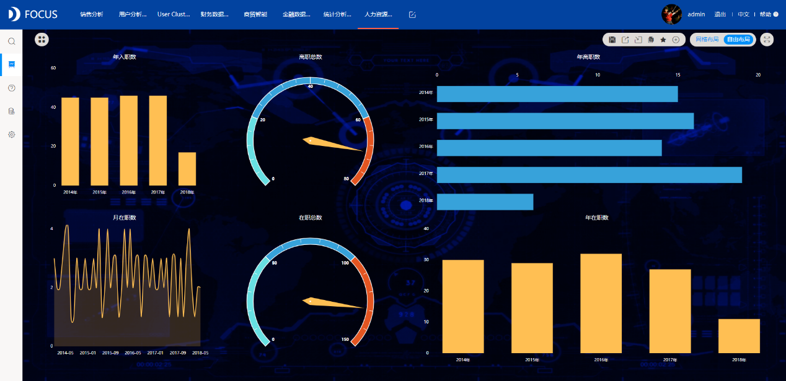

随着数据在我们现如今的工作学习中发挥着越来越重要的作用，被越来越多的人认识和了解到它的优势，利用各种可视化工具对企业相关的大数据进行数据分析，提高工作的效率，帮助企业制定决策提供了有价值的参考。特别是商业BI工具的诞生，比如DataFocus、Tableau，帮助越来越多的公司进行可视化，实时监测企业数据，提供科学性的决策参考。那么专业的可视化人员是如何进行数据分析的呢？整个数据分析的完整流程是什么样的呢？

首先，一定是确定一个分析目标

一个明确的分析目标就像远行大海中的一座灯塔，能够为此次数据分析指引前进的方向，不至于迷失方向。简答来说，明确的分析目标也就是需要知道，此次报告结构的受益对象是谁？想要通过此次数据分析得出什么结果、达到什么目的？可以是企业的产品在中国那部分区域的销售量是最好的，以及导致销售量较低的主要原因之类的。

其次，了解业务流程

在确定好目标之后，必须对公司业务的流程进行一定的了解。若是对公司的业务情况一无所知，就无法知道什么是导致业务量下降的重要原因，找不到关键因素，无法提取重要变量。

第三，提取数据

在对业务逻辑有了一定了解后，我们就可以进行提取数据了。这个步骤很大程度上与第二步相关，也就是说你从第二步分析出了什么重要变量、外部因素，就可以按照这些变量和因素寻找需要的数据或字段。

第四步，也是最重要的一步，数据分析

需要的数据已经整理完毕，接下来就是进行实际操作了。数据分析的过程并不是简单的排序，数据中可能存在很多的无用数据需要过滤，如何从密密麻麻的数据中，需要到企业关心的重点。你也可能会发现很多有趣的数据，找到一些有趣的规律，例如经典的啤酒和尿布案例。

第五，得出结论

最后的一步就是将数据分析的结果进行整理得出一份完整的试验报告，并验证一下这份报告的可靠性。

上面这张图片所展示的就是利用DataFocus商业智能软件制作而成的一个公司人力资源可视化看板，bi工具可以帮助大家的就是在数据处理和数据分析方面加快企业的分析过程，提高分析效率，并提高分析的准确性。
