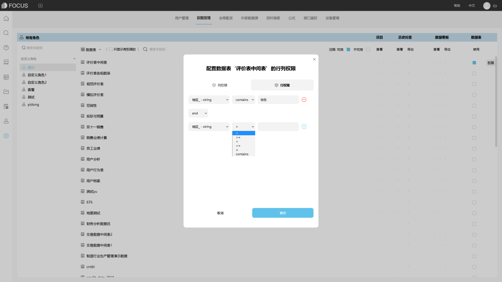

数据可视化成为必须具备的IT技能之一，越来越多的被更多的企业和组织所采纳。经过十来年的发展，数据可视化产品也是从无到有，到现在的百家争鸣。随着一些开源的可视化组件、JS框架广泛的传播，数据可视化的技术门槛也是越来越低。可以说，大量的数据可视化产品或组件功能都可以满足80%以上的市场化需求。

那么企业的IT部门，该如何进行数据可视化工具的选型呢？在选型之前先搞清楚自己的需求，和要实现的目标很关键，尽管大部分数据可视化产品如Tableau、Qlik、DataFocus、DataV等功能大致相同，但是其侧重点还是稍有不同。一般的数据可视化需求典型场景有以下几类：

第一类是政府部门的可视化大屏，实话实话，这类可视化大屏一般追求的效果就是展现，因为它的最大目标就是用于向领导汇报情况和展示政绩。如果预算充足的情况下，可以请专门的团队进行开发，追究极致的可视化效果。当然，有时候也会适得其反，使得领导认为钱花错了地方。

第二类是企业的可视化大屏，这类需求一般也包含第一类的展示要求，但是也要结合企业自身情况，扩展很多功能，如BI功能，数据分析、分享、移动展示等等。而且企业都是市场经济为主，注重效益，对成本的考量也很重要，一般要控制成本。

第三类则主要是用于业务沟通，对纯粹的可视化大屏幕不是很看重，更加关注数据的可视化分析，专题汇报数据看板的制作等等，这类需求更加偏向于企业的BI功能，对产品的易用性，协作性有很高的要求。

 

下面针对几款典型的产品，从多个维度进行了简单的对比，仅供参考：

<table><tbody><tr><td>&nbsp;</td><td>
Tableau
</td><td>
Qlik
</td><td>
DataFocus
</td><td>
DataV
</td><td>
Echarts
</td></tr><tr><td>
开发成本
</td><td>
高
</td><td>
高
</td><td>
低
</td><td>
中
</td><td>
高
</td></tr><tr><td>
开发周期
</td><td>
中
</td><td>
中
</td><td>
短
</td><td>
长
</td><td>
长
</td></tr><tr><td>
能进行代码级二次开发
</td><td>
不能
</td><td>
不能
</td><td>
不能
</td><td>
不能
</td><td>
能
</td></tr><tr><td>
图表和大屏开发方式
</td><td>
拖拽
</td><td>
拖拽
</td><td>
智能搜索
</td><td>
写代码，主要是SQL开发
</td><td>
写代码，前端JS，后端SQL均需要开发
</td></tr><tr><td>
可视化展现美观程度
</td><td>
高
</td><td>
中
</td><td>
中
</td><td>
中
</td><td>
高
</td></tr><tr><td>
支持私有化部署
</td><td>
支持，费用高
</td><td>
支持，费用高
</td><td>
支持
</td><td>
不支持
</td><td>
开源
</td></tr><tr><td>
功能的可扩展性
</td><td>
BI扩展
</td><td>
BI扩展
</td><td>
自带大数据仓库、BI功能、可扩展智能洞察、算法平台
</td><td>
仅可视化
</td><td>
仅可视化
</td></tr></tbody></table>
