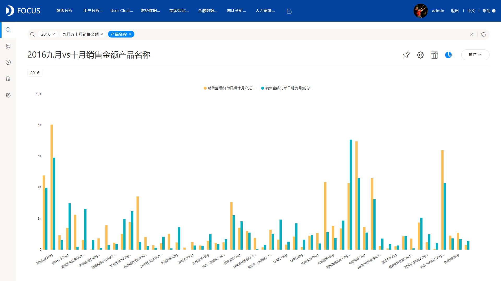

在如今的大数据时代，企业越来越重视自身拥有的销售数据、用户数据、页面浏览数据等，想以数据来驱动企业的业务发展，从而实现企业效益的增长，但是光有数据就可以吗？当然不可以，数据只是基础，是驱动增长的基石，有了数据才能进一步利用数据。

利用数据，就要引入数据分析的概念，数据分析就是对企业积累多年的海量数据，进行挖掘分析，找出数据之间隐藏的关系以及逻辑，并以分析结论制定相应合理的决策，从而促进业务的增长。

那要怎样进行数据分析？如果要进行数据分析，那就离不开数据分析工具的辅助。而选择一款好的数据分析工具是关键，工具的选择结果会直接影响分析的结论，所以选择数据分析工具应该更加慎重。

有着多年数据分析经验的过来人，也用过很多数据分析工具，踩过很多坑，最终选择的是一款非常有自己特色，非常创新，非常实用的数据分析工具—DataFocus。

为什么选择DataFocus？它有什么优点？

我为什么选择它，因为它的创新，它的实操性，它的性价比，它的适用人群等等。

那么，DataFocus创新在哪里，它是国内首个中文搜索式数据分析工具，能用自然语言进行搜索，就跟百度搜索都一样，这种方式革新了传统的拖拽式，我觉得非常有趣创新，用户体验很好。其次，DataFocus的实操性非常棒，简单的搜索就能得到分析结果，没有任何代码，不需要IT基础，就算是普通的业务人员也能很快上手使用。另外它的性价比也值得一提，一个DataFocus，集齐了数据仓库，报表系统，数据分析系统，数据可视化系统于一身，且这几个模块随便哪一个都可以与其功能相对应的专业工具PK，一个相当于四个。

现在大家知道数据如何驱动增长了吗？关键就在于数据分析，而数据分析的核心就在于数据分析工具。
