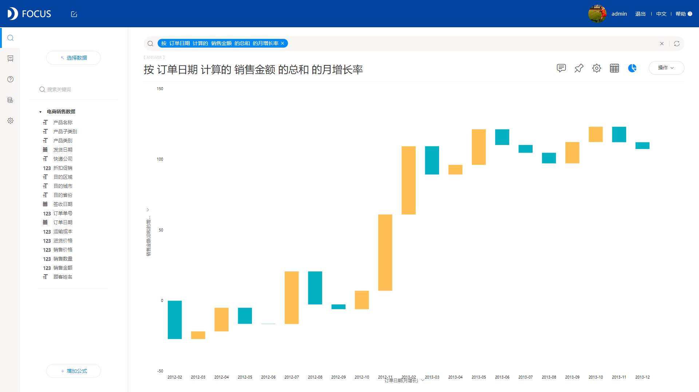

曾几何时，我还是一个什么都不懂的数据小白，励志做一个数据分析师，但是连数据分析是什么都不太清楚，更不要说怎么样进行数据分析了。但是没关系，我现在已经成长为专业的数据分析师了，虽然说不上大神级别，但至少我已经踏入了数据分析这个领域。

今天，我想把我在数据分析这条道路上遇到的困难，踩过的坑，以及可以借鉴的方面分享给大家。

要入门数据分析，你一定要了解什么是数据分析，数据分析就是指用适当的统计分析等方法对收集来的大量数据进行分析，并从中提取有用的信息，形成结论用可视化的形式展示。在实际的业务工作中，数据分析常常辅助企业管理层制定各项决策。

其次，要想进行数据分析，必然要有辅助工具，选好数据分析工具是关键，就像我，在数据分析工具这里踩过多少坑，差点被打击的放弃数据分析。市场上数据分析工具有很多，我之前就选了一款比较有知名度的，但是因为我没有什么IT基础，到后面根本用不下去，因为很多操作以及分析过程还是需要用到IT知识或者代码基础，所以当时很受打击。后来实在不行，我果断放弃这款工具，选择了另一款数据分析工具，正是这款工具帮助我踏入了数据分析的大门，这款工具就是DataFocus，可能很多人也听过。

DataFocus有它“过人之处”，它独有的自然语言搜索式分析，不仅非常创新，还大大降低了数据分析的难度，真的不夸张，我刚学了几分钟，就可以进行简单的分析了。而且它的图表类型也很丰富，时序图、词云图、弦图、箱型图等高级图形也都有，基础的柱状图折线图这些也不少，图表转换也非常简单。总而言之，就是用了DataFocus之后，我的信心又找回来了，它操作简单，功能强大，性价比高，基本人人都可以很好地用它进行数据分析，没有难度，学习成本非常非常低。

原创的搜索式分析

有了用着顺手的数据分析工具，基本就可以算是入门数据分析了，数据分析工具用得好用得溜，你的数据分析也不会差。后面就是要慢慢培养数据分析的一种逻辑思维，什么样的数据适合怎么样分析，各个行业一般都要分析什么数据，查看什么指标，这个没法急成，只能在日常工作中慢慢积累。

看到这里大家可能还是有点迷茫的，但至少应该了解数据分析前进的一个方向，要做哪些准备。最后希望我的经验分享能帮助到大家。
