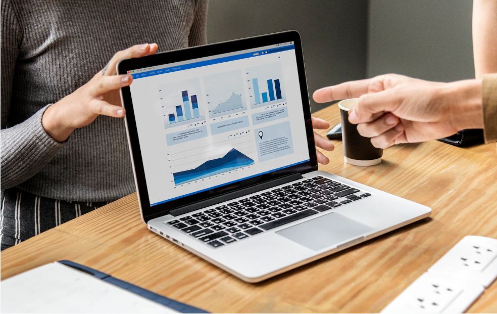

欢迎来到我的博客，今天我们将探讨一个非常重要的话题——数据虚拟化与数据视图的关系。

## 数据虚拟化：提出，发展，出现原因以及场景

数据虚拟化起源于2000年代初，随着大数据时代的到来，公司开始面临如何有效处理、管理和利用庞大数据的挑战。数据虚拟化通过在物理存储和业务层之间引入一个抽象层，让用户可以不必关心数据的来源、格式和存储方式，直接获取和使用数据。这一思路极大地简化了数据处理流程，提高了数据的可用性。

数据虚拟化技术的出现，是为了解决数据碎片化、难以管理和利用的问题。随着数据量的爆炸性增长，企业的数据分散在各种不同的数据库和存储系统中，这给数据整合和分析带来了巨大的挑战。数据虚拟化通过创建一个统一的、全面的数据视图，使得不同数据源的数据可以在一个单一的界面中进行查询和分析，从而解决了这个问题。

数据虚拟化的应用场景非常广泛，包括数据整合、业务智能、实时数据分析、数据管理等。其中，数据整合是最常见的应用场景，企业可以通过数据虚拟化技术，将来自不同源的数据整合在一起，从而获取全面、准确的业务视图。

## 数据视图：定义，使用场景和解决的问题

数据视图是一种虚拟的表，它提供了对物理数据的逻辑表示。数据视图的内容是由查询定义的，当查询数据视图时，系统将运行查询并返回结果。数据视图可以隐藏底层数据的复杂性，为用户提供一种更简单、更直观的方式来访问数据。

数据视图的使用场景主要包括数据查询和报告、数据安全和隐私保护、数据抽象和数据掩盖。通过数据视图，用户可以轻松地查询和生成报告，而不必关心底层数据的存储和处理方式。同时，数据视图也可以作为一种数据安全工具，通过控制数据视图的访问权限，保护敏感数据的隐私。此外，数据视图还可以通过提供抽象的数据表示，隐藏底层数据的复杂性，使得用户可以更加专注于业务逻辑。

数据视图主要解决的是数据访问的复杂性问题。对于底层数据的访问和处理往往需要深厚的技术背景，这对于大多数业务用户来说是一个巨大的挑战。数据视图通过提供一种简单、直观的数据访问方式，使得业务用户可以轻松地获取和使用数据，从而解决了这个问题。

## 常用的数据虚拟化技术和产品

在数据虚拟化领域，有很多优秀的技术和产品，例如，Denodo，DataVirtuality和DataFocus等。

Denodo是一个领先的数据虚拟化解决方案，它可以将来自不同数据源的数据整合在一起，提供一个统一的数据访问接口。

DataVirtuality是一个强大的数据整合平台，它支持多种数据源，可以实现实时数据查询和分析。

DataFocus是我想重点介绍的数据虚拟化产品，它的独特之处在于其内存计算引擎和智能搜索解析模式。DataFocus的内存计算引擎采用并行计算技术，可以实现超高速的数据处理。同时，它的智能搜索解析模式可以根据用户的查询需求，智能地解析和搜索数据，从而实现精准、高效的数据搜索。

结合内存计算引擎的并行计算能力和智能搜索解析模式的精准搜索，DataFocus可以为用户提供高效、质量高的数据服务，帮助用户最大化数据利用。

## 总结

总的来说，数据虚拟化和数据视图是密切相关的。数据虚拟化提供了一种机制，可以创建统一的、全面的数据视图，从而解决了数据碎片化、难以管理和利用的问题。同时，数据视图通过提供一种简单、直观的数据访问方式，使得用户可以轻松地获取和使用数据。无论是数据虚拟化还是数据视图，其最终目标都是提高数据的可用性，帮助企业更好地利用数据，实现业务价值。
