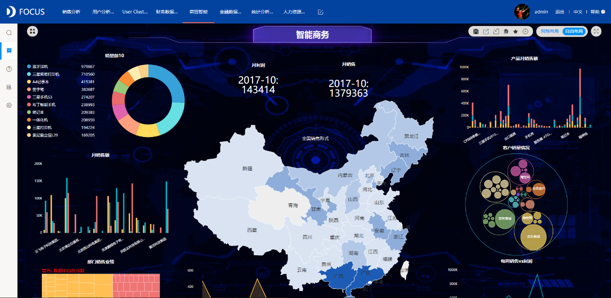

商业智能的兴起帮助很多企业在数据上实现了对数据的监测，将数据转化为有效的决策和信息，反应给管理人员，并及时制定有针对性的决策。但是也有一些数据分析度企业似乎并没有起到任何帮助，这是为什么？其实商业智能分析的结果是否成功，与很多因素有关，毕竟其中涉及的步骤相当繁琐，影响因素包括企业自身的数据、业务，也包含bi自身的分析能力。但抛开其他一切不论，企业提供的数据是其中非常重要的一环。若是作为基础的企业数据本身存在质量问题，到处存在缺失值，就算分析工具再优秀，也无法到达企业分析的预期。所以也有说法称，数据质量决定了BI的成败。

因此企业在发展过程中应注意数据积累，在数据积累过程中要保证数据质量。但据我所知，无论是数据的积累或者数据质量的检验，都是技术部门的事情。数据不属于企业的资产，无法从源头上保证数据的价值，但数据的价值又与分析结果准确性息息相关。这就陷入了无限循环之中。

商业智能应用于企业数据的过程中，数据质量其实一直有收到BI数据分析人员的关注，但是有部分的企业却不将数据这一问题设为最优先的业务，这也就会导致业务数据质量存在一定的问题。那么如何尽可能提高企业内部的数据的质量，就成为了很多企业头疼的问题。虽然越来越多的企业意识到数据能够给企业带来的重要性，但是企业毕竟还是以营利为目的，无法将数据的业务优先权提至一个较高的位置进行解决。

因此帮助企业建立一个完整、有价值的数据流程就变得尤为重要。有效的流程设计、良好的组织结构和企业文化都是影响流程设计的因素。数据质量的保证不是一两个人能解决的，企业应该有一个数据质量的概念，每个数据链都应该贯彻这一概念，这样在实施过程中才能将各部分保持一致。

