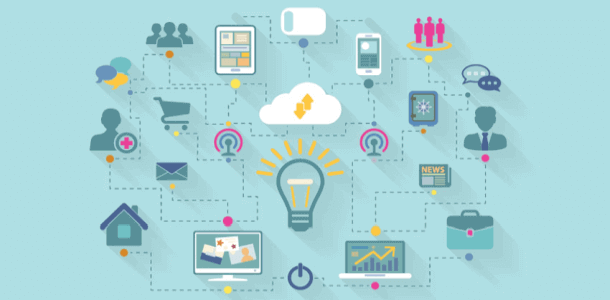

_来源：__多渠道商户_

本文将帮助您探索如何通过数据标准快速打破孤岛和连接系统，从而为分析提供动力、创建混合环境并实现数据现代化。

数据民主化是指高效、快速地打破孤岛和连接系统。这意味着在任何时间、任何地点、从任何数据源为用户提供对数据的访问。在一个拥有数以百万计的商业交易、社交网络、遗留系统、云应用程序和物联网的世界中，数据是丰富的，这使得数据的民主化比以往任何时候都更具挑战性。

数据民主化是一项原则，它表明数据必须可供给定系统或公司中的每个人使用，而不仅仅是关键领导者或专家。数据民主化原则为企业 IT 带来了各种变革。其中，服务和自助服务体系结构的理念使大量用户能够访问数据集。

## 技术和政策是数据民主化的两个必备条件

从政策的角度来看，您必须拥有记录良好的实践和系统，以确保您的组织拥有独立的事实来源。良好的数据治理可确保数据可靠、一致、完整和准确。但是，它需要确保在正确的时间，正确的数据被正确的人访问。“无访问权限”是传统模型中的默认访问级别。作为规则的例外，人们被授予访问权限。但是，如果您开始编写一个重视数据民主化的策略，那么通用访问就是，基于规则的和默认的例外被建立为例外。您的组织如何定义和处理异常是了解您的数据治理形式的关键。

从技术的角度来看，拥有一个可以执行数据治理策略和自动化数据清理的数据仓库非常重要，这样组织中的每个人都知道有一个他们可以信任的可靠事实的来源。仓库启用行级和基于角色的安全性非常重要，这样您可以确保即使鼓励和促进通用数据访问，它也是适合角色的。拥有一个支持自助式即席报告的报告环境非常重要。它还会查看您的报告环境是否定价合理。不管一个报告平台有多少耸人听闻的功能，如果每个许可证的成本非常高，真正的数据货币化在财务上是不可能的。

真正使数据民主化需要一些工作，以使每个人都更容易理解它。理想情况下，我们不必运行更多查询、解释图形或图表、理解结果背后的分析、SQL 中的队列表连接或比较、或执行时间序列分析。数据为我们提供了一扇通往世界的窗口，我们必须允许那些不知道如何使用某些工具的人们访问这个世界——这不是数据的民主化。民主化要求我们为人们提供一种解释数据的简单方法。它需要以每个人都可以学习和理解的形式共享信息。

您必须利用这些数据做出敏捷决策、优化产品、开发新产品和降低成本。那么，如何处理每两年翻一番的数据体呢？最大限度地利用这些数据的理想方式是通过久经考验的标准来创建混合环境、实现数据现代化并支持分析。

## 混合环境

包含托管和本地私有云的混合 IT 以及托管在云基础设施、SaaS 和公共云上的现有客户端-服务器应用程序是企业 IT 的未来。您将没有时间学习每个数据源的每个 API 和格式。无论数据是在云端还是在本地，您都必须尽快访问数据。

在混合环境中，实现数据民主化的最佳方式是通过 OData、ADO.NET、JDBC 和 ODBC 等行业标准接口。通过这种方式，无需维护代码或多个 API，数据被视为关系数据库，并与您熟悉的 SQL 工具一起运行。实时提供跨各种数据源的点击式访问，没有陈旧数据或重复数据。

## 动力分析

是否有可能在不学习任何新知识、移动数据或中断业务的情况下从海量数据流中获益并采取行动？肯定！标准接口使您能够释放数据仓库的商业智能潜力，并允许您使用 BI 基础设施和现有技能执行大量任务。

结果呢？对于直接访问新类型的数据，您可以快速响应需求。最大限度地利用 OData ，从云资源（如Salesforce或 Microsoft Dynamics CRM）上的数据中获取洞察。利用从商业智能工具到各种数据源的标准 ODBC 连接。使用 Apache Sqoop 和 JDBC 摄取 SaaS 数据源，以开发用于分析的营销数据湖。

## 数据现代化

遗留系统将继续存在，这就是现实。它们是大量企业的核心组成部分，成本高昂且难以替代。数据现代化的重点是将这些遗留系统与来自分析、移动和云应用程序的现代数据相结合。

没有人会对在一个技术基础设施看起来相当缺乏灵活性的 IT 部门工作表现出兴趣。如果不进行现代化改造，陈旧的体系结构几乎不可能及时有效地共享信息。这就导致了非标准的手动工作区。您必须最大限度地利用数据标准，以使这些数据易于共享、实时和快速。

## 开始数据民主化

在一个拥挤的市场中，数据和定义你的业务一起使你与众不同。由于在线工具使民主化更容易实现，这一概念的支持者认为，它将缩小小型企业和大品牌之间的竞争空间。反过来，这将创造新的商业模式，改变由数据驱动的商业决策方式，并为新的商业机会打开大门。
