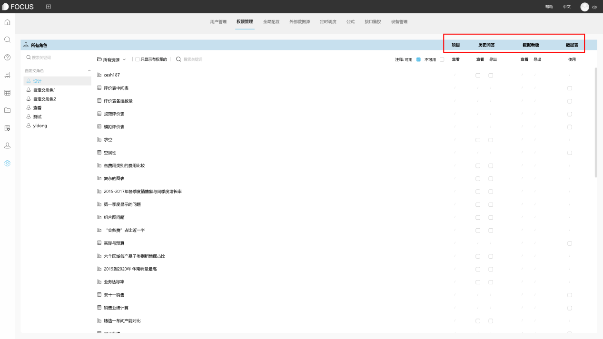

* * *

**最有意思最好玩儿的可视化工具**

很多人看到标题，就会问了，可视化工具还分有没有意思好不好玩儿吗？不就是将数据以图形的形式展现出来吗？确实，可视化的作用就是更好更美观地展现数据，但是数据转变成图形，中间的制作过程就有区别啦。

我说的有意思好玩儿是因为它的实现方式与众不同，有它自己的特色，不随大众，你肯定见过很多工具都是通过拖拽来实现的，也有通过程序代码来实现的，SQL语句来实现的，但是你肯定没有见过通过自然语言搜索来实现的，没错，就是跟谷歌搜索一样的搜索方式。那到底是何方神圣呢？它就是DataFocus，集齐数据仓库，数据分析，数据可视化，报表系统于一身的“神器”。

是不是无法想象怎么通过搜索来实现？现在，就带大家看一看。

DataFocus主推搜索，所以肯定有个搜索框，搜索框里面其实信息量巨大，包括有各种智能提示，自然语言处理等等，那搜索框里要怎么输内容呢？其实在DataFocus中内置有大量的关键语句，系统会自动识别关键词句，然后实时的返回结果，例如，想要知道某企业整体的销售增长趋势，那么，可以在搜索框内输入：按订单日期计算的销售额的月增长率，如图；

或者想要知道每季度各产品的销售情况，可以直接在搜索框内输入：产品名称 销售金额 每季度，如图；

有人说，那我还想知道最常用的Top功能可以搜索吗？当然可以。

例如：想要知道销量榜前10是哪些产品，那么可以直接在搜索框内输入：排名前10的销售金额的总和 产品名称，如图；

怎么样，是不是感受到了可视化不同的乐趣，对可视化的实现方式有了全新的认知？DataFocus将图形的实现方式从传统的拖拽式完全革新成更潮流的搜索式，我想，在不久的未来搜索式的实现方式必然是主流。
