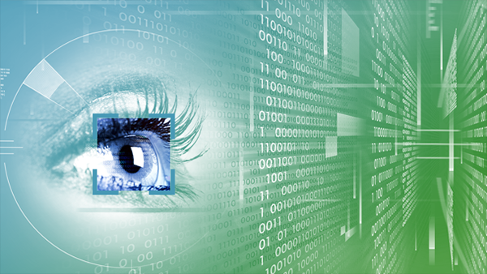
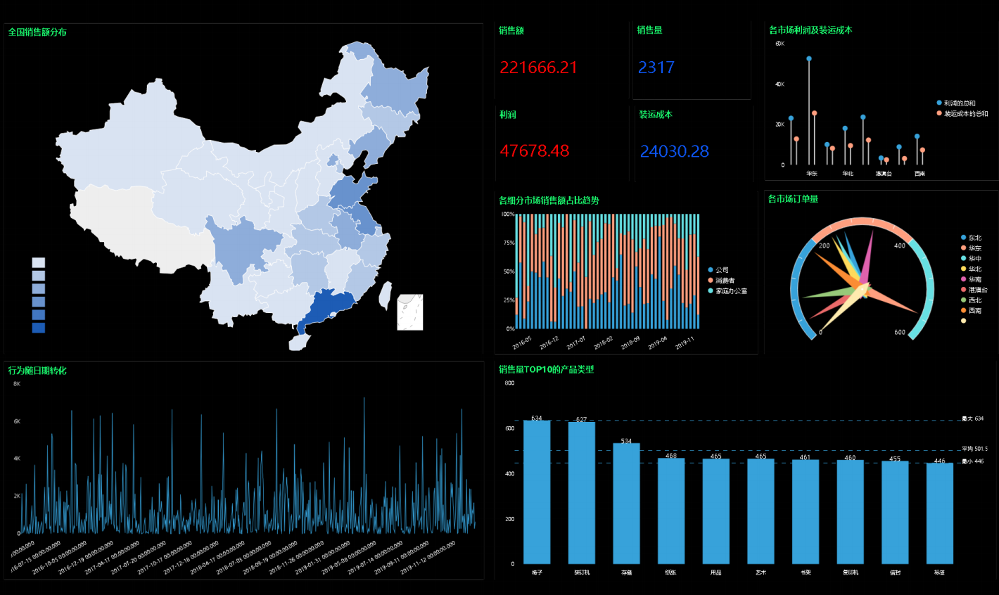

strong>图1：你看到了什么？

人眼是一个具有高度并行处理能力的器官，人类视觉具有迄今为止最高的处理带宽 。视觉是人的诸多感觉中最优越，也最强大的一种——一方面视觉直接生成形象，另一方面视觉又与逻辑、理性密不可分。

视觉分为低阶视觉和高阶视觉，人工智能的发展使得计算机已经能够部分模仿低阶视觉，然而在高阶视觉方面仍然力不从心。

strong>图2：人类视觉具有迄今为止最高的处理带宽，图片来自网络。

strong>另一方面，人类视觉对于以数字、文本等形式存在的非形象化信息的直接感知能力远远落后于对于形象化视觉符号的理解。

例如，人们需要顺序地浏览一份数字化报表，才能获悉各子类别的销量，在这个过程中还需要占用一定的大脑记忆进行存储。

strong>图3：电子表格中的数据

采用柱状图的方式来可视化销量数据，用户可以快速直观地获得各子类别销量的对比。

strong>图4：柱状图展示的数据

数据可视化技术正是这种将数据转换为易被人感知和认知的可视化视图的重要手段。一般来说，这个过程涉及数据处理、可视化编码、可视化呈现和可视交互等流程。**当然，现在借助DataFocus这样的数据可视化工具，可以帮助用户省去技术难度高、操作复杂的编码过程，直接实现无代码可视化呈现。**

strong>图5：DataFocus制作的可视化大屏

可视化的意义是帮助人更好地分析数据，信息的质量很大程度上依赖于其表达方式。而数据可视化的本质就是视觉对话。数据可视化将技术与艺术完美结合，借助图形化的手段，清晰有效地传达与沟通信息。

一方面，数据赋予可视化以价值，另一方面，可视化增加数据的灵性，两者相辅相成，帮助企业从信息中提取知识、从知识中收获价值。

数据可视化具有以下优势：

1、更直观地展示信息

大数据可视化大屏使我们能够用一些简短的图形图表就能展示海量数据，决策者可以轻松地感知数据结果。

2、传递速度快

人脑对视觉信息的处理要比书面信息快10倍！使用图表来展示复杂的数据，就是效率的提升。

3、数据显示的多维性

在可视化的分析下，数据按照不同维度进行分类、排序、组合和显示，这样就可以看到表达对象或事件的多个属性或变量。 利用DataFocus，创建可视化数据大屏，直观展示数据，帮助企业提升效率。赶快试用吧~
