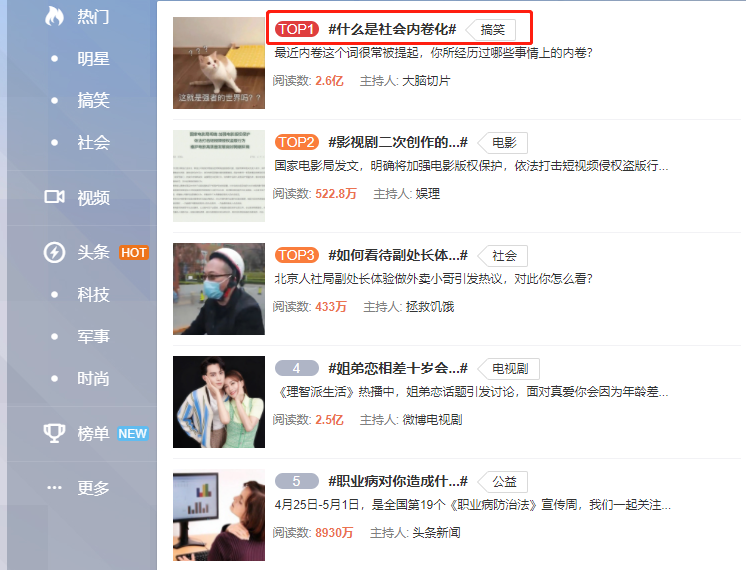

## 电商运营模式

这一章节的内容主要包含电商数据分析公式、指标以及电商运营的飞机模型理论，主要是帮助建立对电商运营的基础认知，希望可以从宏观层面帮助读者快速建立起对电商运营的“上帝视角”。

## 电商的本质

电商的本质是什么？

电商是平台，聚集众多品牌和消费者，充斥着各种必须遵守的平台规则；电商是渠道，给品牌带来了在线上交易的新机会；同时，“电商=零售，零售=成交”。

几乎所有公司的成立都是以盈利为首要目标，而公司所有部门、工作人员也都是围绕‘成交’两个字在转。网站的页面设计要尽可能满足用户的使用习惯，广告投放需要针对不同用户群体进行精准营销，服饰的选择也需要遵循当季时尚潮流等等，包括接下去我们会制作的数据分析报告，也是以辅助电商运营，提升公司的销售业绩为目标的。

## 一个公式

电商数据分析有一个非常基础的乘积公式，同时也是监测电商运营的重要公式：

图2-1 电商分析基础公式

从专业角度讲，UV（Unique Visitor）就是独立访客，访问网站的一台电脑客户端为一个访客；这里的转化率指的是买单人数与UV访客之比；客单价就是每一个顾客平均购买的商品金额。三者相乘，就得到了销售额。

灵活运用这三个指标，我们可以进行对电商的运营状态进行监测，同时可以借助该指标制定年度销售目标等。

图2-2 某电商公司每日UV监测（图源：DataFocus）

在电商运营过程中，这三个指标值应该是处于一个相对稳定的状态，如果这三个数值的大小突然出现剧烈的波动，那么电商运营的过程中必然出现了某些问题。一般服装行业都会明确自家店铺的UV、转化率、客单价指标，然后利用这三个指标监测店铺的运营情况，若指标出现不支持时，可以及时找到问题所在。

其次是制作年度运营目标。上述的公式是一个纯乘法公式，那么一定会遵从数学上的乘积效应，UV、转化率、客单价都与销售额成正比，当三个因数中的每个因数都有细小的变化时，对销售额就会产生巨大的影响。借助这个原理，可以根据三因素指标的变化趋势，预测第二年的销售额；同时根据预测的销售额，进行一系列的营销推广策略，反推指标增长，最终达到公司盈利上涨的目的。

## 电商企业整体运营

作为一名优秀的数据分析师，切忌目光狭隘，必须具备“上帝视角”，纵观全局，从企业整体运营角度，从行业的角度，找出数据背后的业务痛点，让数据真正产生价值。如果从全局角度认识电商企业的整体运营，可以用一个飞机模型来简单说明。

将一家电商企业比作一架飞机模型，模型的各个部件分别对应企业的不同部门，大家一起齐心合力让这架飞机非得更高更远。当然，针对企业部门与模型部件之间的对应关系，根据企业不同的运营模式、核心竞争，这个问题的答案并不唯一。这里以之前接触到的某电商企业为例，介绍一个这个飞机模型图。

如果将该电商企业的事业部看成一架飞机模型，那么运营部就是驾驶员，他们可以结合外界情况的变动和企业内部的状况，制定最适合企业发展的决策，驾驶着这家飞机，及时调整航线和飞行高度；设计部是飞机的尾翼，他们负责把控企业服装的品牌风格，保持飞机的平衡；商品部和市场部是飞机的两个机翼，通过商品备货、市场推广等手段负责事业部在飞行过程中的方向选择；客服部像是机舱的乘务人员，负责安排并照顾好已经登机的乘客；数据部门则对应地面的塔台，负责监测企业经营过程中的各项数据指标，同时结合市场风向、行业情报等做出预判，随时沟通飞机驾驶员，提出飞行警示信息。

这一章节的内容，主要是通过一个等式、一个公式、三个指标和一个飞机模型，帮助大家建立起对电商运营的上帝视角，更好的理解电商运营所涉及的基础知识。无论是电商运营还是数据分析，都是一个成长的过程，需要不断积累经验，相信假以时日，我们都可以成为更好的自己。
