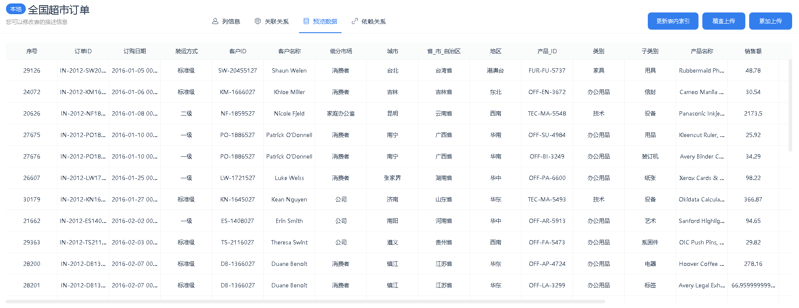
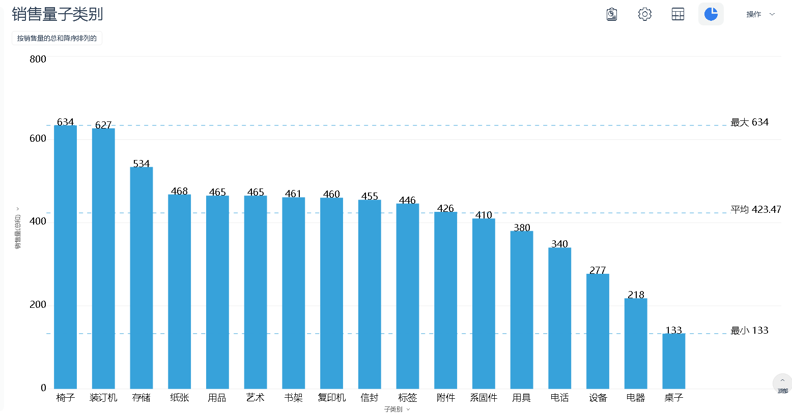

随着精细化营销理念的普及，人们对营销的认识也逐渐深入，越来越多的营销人员认识到，营销不仅是一门艺术，也是一门科学， 在市场快速变化的时代，基于数据进行分析，对市场需求、客户行为进行科学准确的掌控，才能更好的为后续的营销动作提供参考。

_1_ 营销人员的常见问题

通过数据分析，营销人员可以找到以下问题的答案。

问题一：**流量从哪里来？**

互联网时代就是流量的时代，得流量者得天下，但是做了这么多营销推广，究竟哪个渠道是有效的渠道的质量又该如何比较。

问题二：**吸引来的用户为什么没有转化？** 引流曝光率上去了，转化率却不高，苦于没有优化的方向。问题到底出在哪里？

问题三：**ROI如何提升？**

ROI是衡量营销效果的终极标准，也是营销人员考核的核心指标。如何提升ROI也是营销人员始终需要考虑的问题。_2_

像搜索一样简单的数据分析工具

但是，如何才能更快地学会数据分析，提升自己的营销力，也成为了广大营销人员和营销团队的难题。毕竟，平时的工作时间紧任务重，想要做出好看实用的图表，又需要花费大量的时间。幸运的是，数据分析工具已经取得了很大的进步，学习成本也越来越低，只需要找到正确的工具，营销人员很快就能搞定数据分析。

而DataFocus就是这样一款为营销人员准备、学习成本低、只需10分钟就能上手做出精美图表的数据分析系统。

DataFocus和一般的数据分析工具不同，它最大的特点是可以用类自然语言来交互，只需像使用搜索引擎一样输入问题，DataFocus就能自动进行数据分析和可视化呈现。

下面，让我用一个实际案例展示一下，DataFocus是如何帮助营销人员进行数据分析的。

_3_ 数据导入到数据可视化

进入DataFocus之后，左侧有数据管理、搜索、数据看板等版块。数据管理可以上传和管理数据，搜索就是对数据进行分析和做各种图表；数据看板可以展示数据分析的结果。

 

 

**案例分析：某平台流量的数据分析**

将原始数据导入DataFocus中，在搜索框中输入日期、浏览量PV、每天，即可得到每天的访问量折线图。

从数据可以看出，网站目前的访问量还不稳定，处于小幅度波动状态，但11.19日和11.25日出现了两个峰值，结合网站的营销节奏，营销人员可以判断这个峰值与什么营销动作有关，从而进一步评估营销效果。

 

 

继续看访客数的情况。只需将访问量PV改成访客数UV，就可得到如下结果。我们还可以更换图表的展示方式，在这里，我将它改为柱状图。

 

继续看访问渠道来源情况。输入来源类型、浏览量PV，就可以得到根据来源类型统计的访问量占比。该网站的访问由3部分组成，其中搜索引擎占比83.25%，直接访问占比13.05%，外部链接占比3.71%。**如果原始数据中包含外部链接的具体来源，还可进一步定位外部链接的有效性，为营销渠道的选择提供有力的参考。**

 

在原来的参数上，加上每天这个关键词，我们就可以得到不同来源类型每天的访问情况。进一步确认PV和UV波动的原因。**从这张图表中可以看到，11.19日和11.25日出现了两个峰值，主要来源于搜索引擎。可以结合实际的动作，判断出当天是什么营销动作导致了搜索引擎访问增长，为后续营销复用提供参考。**

不需要任何人工计算，输入跳出率的平均值、来源类型，就可以统计出不同来源类型的跳出率。可以看出，搜索引擎的平均跳出率为16.1%，外部链接的平均跳出率为40.9%，直接访问的平均跳出率为43%。

不需要任何人工计算，输入跳出率的平均值、来源类型、日期、每天，就可以统计出每天不同来源类型的跳出率。如果每天坚持监控跳出率，营销人员就能发现一些异常点，提升用户留存和转化。

_4_ 总结

DataFocus作为全球首个中文类自然语言数据搜索分析系统，可以让不懂代码、不会SQL语句的营销人员在3秒内完成图表制作，10分钟创建出美观的可视化大屏，真正为营销人员节省时间、节省成本、节省精力。

**使用DataFocus一起让数据分析像搜索一样简单。**
