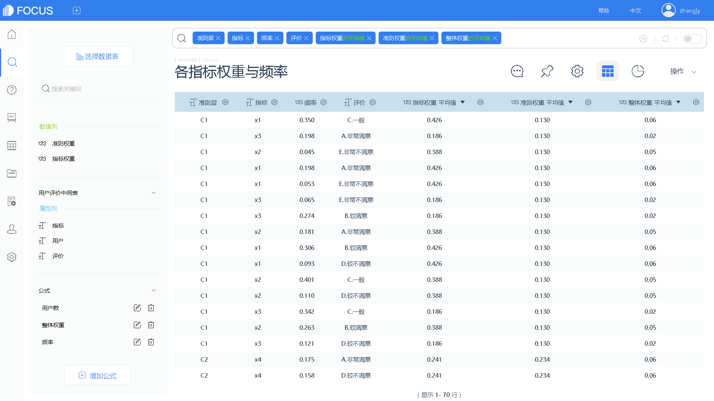

货品作为销售的弹药，需要定期查看是否储备充足，是否有占用过多资金，以及是否可以创造足够的利润。

今天，我们从销售状况的角度，继续分析存货情况。了解如何通过DataFocus，分析并制作一份销售概况的可视化报告。

## 数据源

我们继续使用上文分析“存货库存概况”时用到的“销售库存明细”表，将该表导入DataFocus的过程主要是：

1. 登录DataFocus Cloud后，进入数据表管理模块。
2. 点击“导入表”按钮，将“销售库存明细”从本地导入系统。
3. 导入成功后，进入该表详情界面，将“年份”的列类型改为“属性列”

## 搜索分析

### 1、进入搜索模块，点击“选择数据表”按钮，将“销售库存明细”表选中，以对表中数据进行分析。

### 接下来，点击“增加公式”按钮，进入公式编辑界面，计算所需指标并保存为公式列。

#### 计算销售零售额、库存金额

【销售零售额】销量\*零售价

【库存金额】库存数量\*零售价

#### 计算货龄区间

本次计算货龄，将计算日期截止到2020年6月30日。

【货龄】diff\_days(" 2020-06-30" ,上市日期)+1

【货龄区间】if 货龄<=30 then" 30天以下" else if 货龄<=60 and 货龄>30 then" 30-60天" else if 货龄<=90 and 货龄>60 then" 60-90天"else if 货龄<=120 and 货龄>90 then" 90-120天"else" 120天以上"

#### 计算销售折扣

折扣是零售业务中非常重要的指标。若折扣过高，但消费者没有购买意愿，则不能产生足够的利润；若折扣过低，低于运营成本，则会产生亏损。

【销售折扣】sum(销售额)/sum(销售零售额)

#### 计算毛利率

本次，我们假设进货折扣为零售价的40%

【毛利率】(销售折扣-0.4)/销售折扣

#### 计算存销比

用库存数量除以月均销售数量，来评估需要几个月可以消化当前存货数量。表中使用的是一个月数据，因此直接将“库存数量的和”与“销售数量的和”相除。

【存销比】sum(库存数量)/sum(销量)

#### 上下装

数据源表中，包含“裤”和“裙”字样的产品类别为下装，其它为上装，因此可以使用公式对“类别”进行分类。

【上下装】if contains(类别,"裤") or contains(类别,"裙") then"下装" else "上装"

### 接下来，我们进行搜索分析，并将制作的图表固化到系统

#### 总销售金额、存销比、销售折扣、毛利率

双击或搜索框中输入列名“销售额”，获得“总销售额”数据。之后，在“图形转换”中更换为“KPI指标”图，再进入“图表属性”，设置隐藏标题等内容，即可得到如下图表。最后，在操作栏下保存，将该图表以历史问答形式固化到DataFocus系统。

同理，得到“存销比”和“销售折扣”的KPI指标图。

在制作“毛利率”的KPI指标图时，我们需要在轴名称处，配置显示的格式为百分比形式，并可对小数的位数进行设置。设置完成后再进行保存。

#### 分别按性别、季节、类别查看销存匹配程度

按类别对比销存情况时，先双击列 “类别 ”、“销售额”、 “库存金额” 、“存销比”，将其添加至搜索框中进行搜索，再于“图形转换”中更换为组合图。

组合图的右侧会有“配置图”按钮，可将“存销比”配置到右Y轴。在组合图的图例处，可以对显示的柱状图或折线图进行更换。

在图表属性设置中，设置标签的文本为 %\_PERCENT\_OF\_TOTAL ，则可以通过标签，直接看到男装或女装的库存金额占比、销售金额占比。

从图柱上的标签可以看到，牛仔长裤销售占比和库存占比差异较大，且存销比较高，存在滞销风险。

同理，制作“季节销存对比”和“性别销存对比”的组合图。

#### 库存TOP10销售概况表

在制作“库存量排名前10的产品销售概况表”时，同样先搜索相关列名。接下来，在“库存数量”后输入关键词“的总和”和“排名前10的”，如图所示，来获取“库存数量的和”排名前10的产品，切换为数值表。最后在操作栏下进行保存。

从表中可以看到，到2020年6月30日，部分短袖的库存量较大，所需售卖天数较长，出清进度缓慢，需及早开始促销。

牛仔长裤的存销比也较高，但这份数据分析的是夏季，即使牛仔裤打折，销售速度也不一定会加快，因而可待天气转凉后再计划。

### 制作并保存图表后，即可开始制作“存货销售概况”的可视化报告

我们进入数据看板模块，点击“创建”按钮后，选择模板来新建一张数据看板。

本次，我们不用空白模板，而是选择之前制作的一份大屏模板。

将模板中的组件替换、调整为我们所需要的内容、形式，即可制作好一张可视化报告。

保存后，可点击“预览”，进行全屏查看

