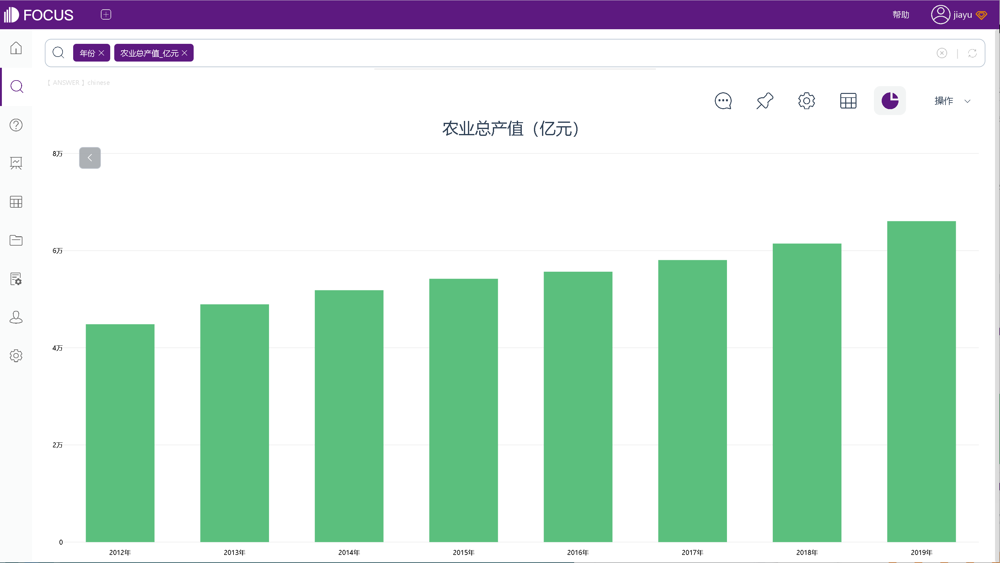
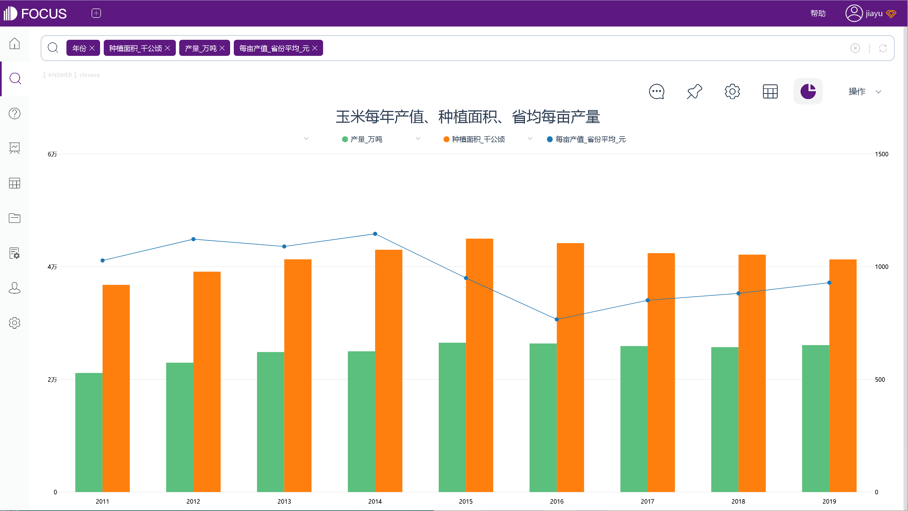

PEST分析法，一般用于做行业分析，,为从各方面把握宏观环境的现状及变化趋势。PEST即指 政治（Politics）、经济（Economy）、社会（Society）、技术（Technology）。

我们以农业为例，来了解下PEST分析法 以及该方法的简单应用。

## 1、**政治（Politics）**

从政治环境上进行分析，包括国家制度、政府政策、法律法规等方面内容，来了解行业变化。例如，在农业方面，6月10日财政部、农业农村部发布2022年重点强农惠农政策，今年我国继续加大支农投入。

## 2、**经济（Economy）**

从经济环境的宏观、微观两个方面分析，如国民生产总值、国民收入、消费者偏好、消费者收入水平等。这些因素关系着企业目前与未来的市场。

根据国家统计局统计，2019年农业总产值达66066.45亿元。（图形制作：DataFocus）

农产品包括水果、蔬菜、肉类、蛋类、奶类等等，其中，玉米在2019年产量为26078万吨，种植面积达41284千公顷，全国平均每亩产值928.9元。（数据来源：国家农业农村部；图形制作：DataFocus）

## 3、**社会（Society）**

从社会环境上分析，了解人们的市场需求、爱好和消费行为。分析因素包括人口结构与趋势、受教育水平、民族文化、可支配收入水平等等。大致分为人口因素、社会结构、心态观念、社会文化、生活条件等方面。

## 4、**技术（Technology）**

最后，从技术环境上进行评估。了解当前技术水平、技术相关政策、目前新产品开发能力以及技术发展的动态等等。技术革新成果可能会对行业起到颠覆性影响。

总的来说，PEST分析法就是从政治、经济、社会、技术四个环境上进行分析。它可以在企业制定战略时，提供判断趋势、机会和挑战的依据。
