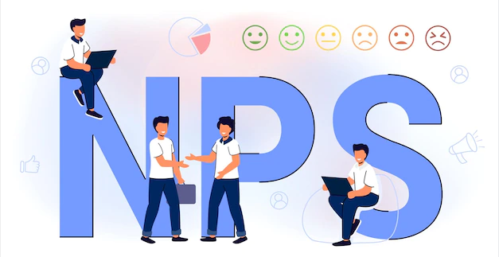
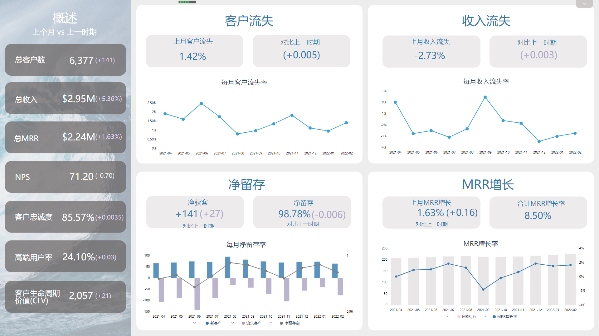

提问：你的产品真的是用户所需要的吗？

继续提问：上述问题的答案是依据假设或少数的高级用户回复的内容来回答的么？

最后一个问题：作为一个产品经理，你知道跟踪产品的哪些指标是最重要的么？

如果你对第一个提问的回答是“Yes”，第二个是“Yes”，并且第三个提问是“No”的话，那么我相信，这篇文章就是你需要的。

我们团队与业内多名专业的销售数据产品和服务的人士交流后，整理了一份专家产品指标列表，通过了解专家对产品指标的跟踪，衍生到日常工作中，希望能帮助您更好地评估产品的性能。

## **什么是产品管理指标？**

指标是衡量预期目标的参数，通过可量化的产品指标，可以帮助产品经理对产品的表现有对应的了解。通过正确跟踪产品管理KPI，可以对产品的性能有准确的把握，并以此改进您的产品。

## **如何衡量产品管理的成功？**

我们了解到，在衡量产品成功与否时，对B2B最有帮助的三个产品管理指标分别是：

- 收入（MRR、ARPU、CAC、CLV/LTV、ACV）
- 用户满意度（NPS、CSAT、OSAT）
- 留存/流失

但大部分跟踪这些产品指标的公司都将大量时间花费在分析产品数据和获得洞察上，根据洞察结果采取行动只占了很少一部分时间。因此我们建议，在确保跟踪正确的产品管理指标的前提下，需要借助一个现代化的工具，实现产品数据的实时监测，通过例如图表、看板、大屏，查看并审核产品指标体系。通过如DataFocus等专业的现代化数据分析工具，大大缩短数据分析的时间，将更加的精力花在产品管理指标体系的建立和完善上，可以更快得出产品的有效见解。

## **成功的产品经理跟踪的关键KPI**

接下来，是产品指标的完整列表及其详细信息，通过对产品管理指标的介绍让您了解为什么要监控这个指标。

### **1.每用户平均收入（ARPU）**

每用户平均收入(ARPU)，有时候也称为每个帐户平均收入(ARPA)，其含义是一段时间内，从用户处获得的平均金额。ARPU的计算方法是用一段时间内的总收入除以活跃用户数量。

ARPU没有绝对的高和低，需要找准适合自己的基准值，然后结合其他因素分析其上升下降的原因并找到针对性的解决方法。通过关注ARPU，定期确定每个用户产生的收入变动，有助于企业在计划改进产品功能和改变价格时，定义未来的服务收入，在客户满意度和业务利润之间可以取得完美的平衡。

### **2.获客成本（CAC）**

从本质上说，CAC指的是获得单个客户的平均费用。

CAC指标是营销努力和产品集成之间最直接的关联。CAC过高表示在客户营销上花费了大量资金，这意味着该策略不宜扩展；而当CAC保持在较低水平是，表明营销支出正在发挥作用，并且正以合理的速度获得新客户。

一个好的CAC指标可能会告诉用户有机会以更低的成本获得新客户，或者以相同的支出获得更多客户。

### **3.客户生命周期价值（CLV/CLTV）**

CLTV意为客户生命周期价值，也可以称客户终生价值，是公司从客户所有业务或互动的整个过程获得的收入总和。

**客户终生价值(CLV)显示了客户对您的产品或品牌的忠诚度。**

终生客户可以描述为持续与平台进行互动或者以一致的速度不断从网站购买产品的人。网站通过与客户建立联系，确定终身关系，在客户和产品之间创造出情感价值以增加业务收入和客户留存。

### **4.净推荐值(NPS)**

通过向受访者提出一个问题，答案为0-10的等级，询问客户推荐企业的产品或服务的可能性。统计结果，0-6为贬损者，9-10为主动推荐者，最后用主动推荐者的百分比减去贬损者的百分比，将得到的结果乘以100最终得出净推荐值(NPS)分数。

按照推荐等级可以将用户分成三类，可以对企业组织的整体客户架构有一个清晰的了解。通过了解整体NPS，可以**衡量满意客户数量和平均满意程度的忠诚度。**

如果跟踪单个产品、商店、网页甚至员工的分数，还可以提供有价值的见解，了解哪些因素可以提高客户忠诚度，确保客户成功的持续增长。

### **5.客户保留**

客户保留率是产品增长需要跟踪的关键管理指标之一。它会告诉你目前有多少忠诚的客户，以及如何改进以扩大数量；其次还可以帮助企业了解客户与产品保持互动的原因，并以此增强企业的营销策略。

细分客户流失率可以得出很重要的一点——你的理想客户是谁？以及你没有为谁服务。后续产品开发可以支持更多的客户或者改进让您的服务对理想客户更具吸引力，以此影响群体的营销目标和活动。

较高的客户留存，可以确保产品不是一个会漏水的桶，会有越来越多的客户使用产品，而不是看起来每天都有新客户，但其实这些客户在几天后就放弃了。

通过向用户提供折扣券或者改善用户体验等方法都是提高客户留存率的好方法。

### **6.每日或每月活跃用户（MAU）**

每日活跃用户(DAU)或每月活跃用户(MAU)是产品经理需要密切关注的指标。顾名思义，DAU/MAU就是一天或一个月的活跃用户数，是衡量产品整体健康状况的指标，也是与产品参与度相关的重点指标。

DAU帮助企业创建了一份关于每个产品的用户群随时间变化的综合报告，评估用户与产品交互的频率。利用DAU这一产品参与度指标可以使企业就产品中添加或删除特定功能做出战略决策。

### **7.重复购买率（RPR）**

在零售市场吸引和留住现有客户变得越来越难。因此，保持较高的重复购买率对企业是非常有必要的，忠诚的客户是稳定的收入来源。重复购买率的计算方式是，在同一个月份，找到下订单的客户数量和回头客的数量，然后用回头客除以总客户数。RPR的理想范围是20-40%。

获取一个新客户的成本明显要高于留住一个老客户。同时，重复购买率(RPR)展示了客户的忠诚度，随着重复购买率的提升，产品品牌的忠诚度和口碑也会随之上升。

根据统计，那些不断回来购物的人通常会在每个后续订单上平均多花费3%-15%。这种额外的支出不仅提高了每个订单的平均金额，同时显着提高了客户的生命周期价值。

关于如何提高RPR并且减少客户流失，这里提一点建议：

**专注于提供最佳体验，学会使用“最少点击次数”**

现在的卖家格外注重良好的购物体验，通过最少点击次数，使用户在任何时候都距离他们想要的目的地只有一两次点击，以此提供最佳体验，增加回头客数量、减少客户流失同时提高CLV。

## **监控关键产品管理指标和KPI**

现在您已经有了一个应该跟踪的产品指标列表，将其整合到一个或多个看板中进行密切监控。举例如下：

  

_DataFocus产品管理指标大屏_

将数据源连接到DataFocus，用十分钟创建好一个极具视觉吸引力的数据看板，系统会自动更新看板上的数据结果，后续您只需要专注于优化指标体系和得出洞察结果即可。

如果感觉文章对你有所帮助的话，欢迎点赞、收藏、关注哦~
