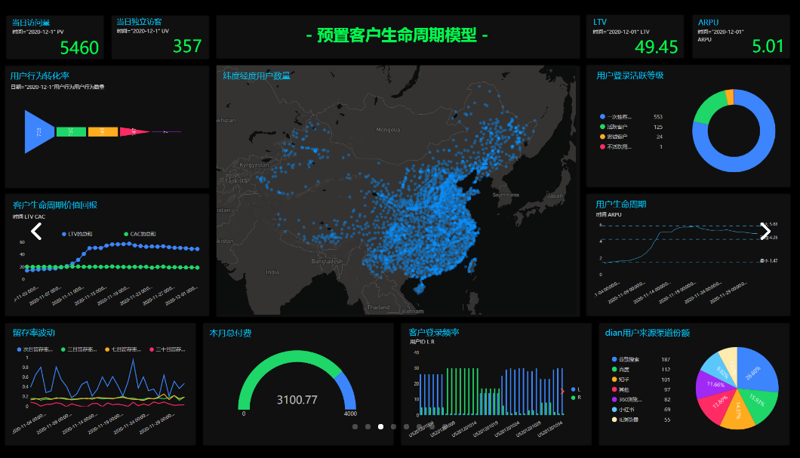
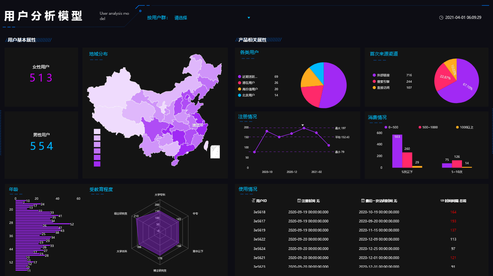

**酷炫大屏，就是这么简单**

首先，请欣赏接下来的酷炫大屏，允许秀一波。

秀

再秀

接着秀

好了，秀完了，说正事，大屏酷炫吗，是否也想要做一个如此酷炫的大屏呢？听到这，是不是会觉得做一个这样的大屏很复杂？复不复杂，其实很大程度取决于你采用的可视化工具，如果选的好，事半功倍，没选好，难上加难。

我们此次采用DataFocus可视化工具来实现。上述三个大屏就是用的DataFocus，为什么选用它，因为它符合我们的要求，操作简单，功能强大，图表丰富，大屏美观酷炫，而且够智能，用它，可以事半功倍。

现在，跟着我，一起来制作一个酷炫大屏。

1、搜索创建多个图表，在可视化大屏中，不可能只有几个图表，往往是由多个图表组合而成。将结果保存为历史问答，点击“操作-保存”，保存之后点击右上角图钉按钮，添加到可视化大屏中；

创建图表，保存添加到大屏

2、进入可视化大屏，切换至自由布局，选中图表进行拖动调整位置，选中图表拖动图表边框调整大小，一般地图这些，都会放在大屏中间位置，排版要合理有层次；

3、设置大屏背景，可上传图片或者自定义颜色，设置图表文字颜色以及背景，点击左上角全局配置按钮，按照提示项配置，背景颜色等配置要符合多数人的阅读习惯；

4、设置自定义标题组件，点击右上角自定义组件，选择浮动组件，选择文字，将浮动组件的背景设置成图片，上传，也可以自定义颜色，此处上传图片，在框内输入标题文字“XXXX”，设置文字大小，调整浮动组件大小以及位置，顶部居中位置；

5、全部设置完之后，点击右上角保存按钮，即可保存所有设置，点击全屏按钮，全屏显示大屏，可视化大屏制作完成；

大屏制作完成了，是不是很简单很秀？只需要5步，几分钟就可以完成一个酷炫的大屏，制作过程中也没有任何复杂的地方，可以按照自己喜欢的风格随意设置，快点去试试吧。
