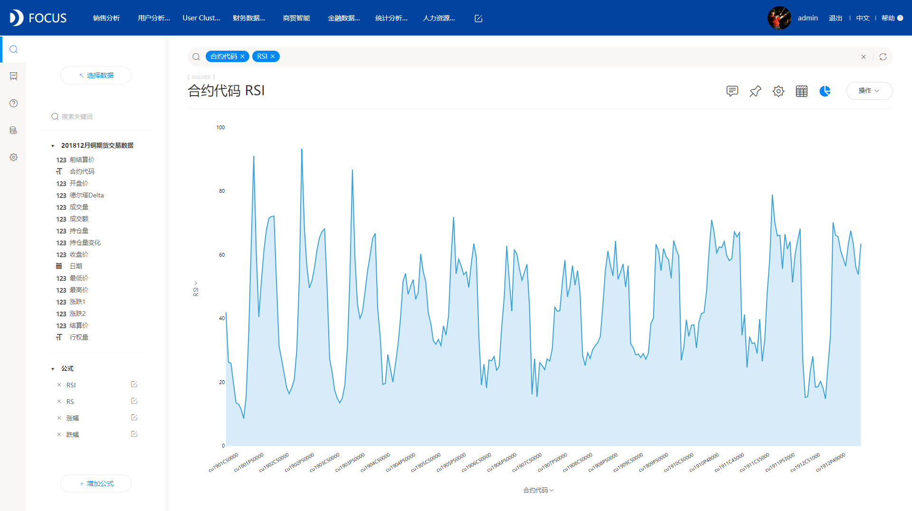
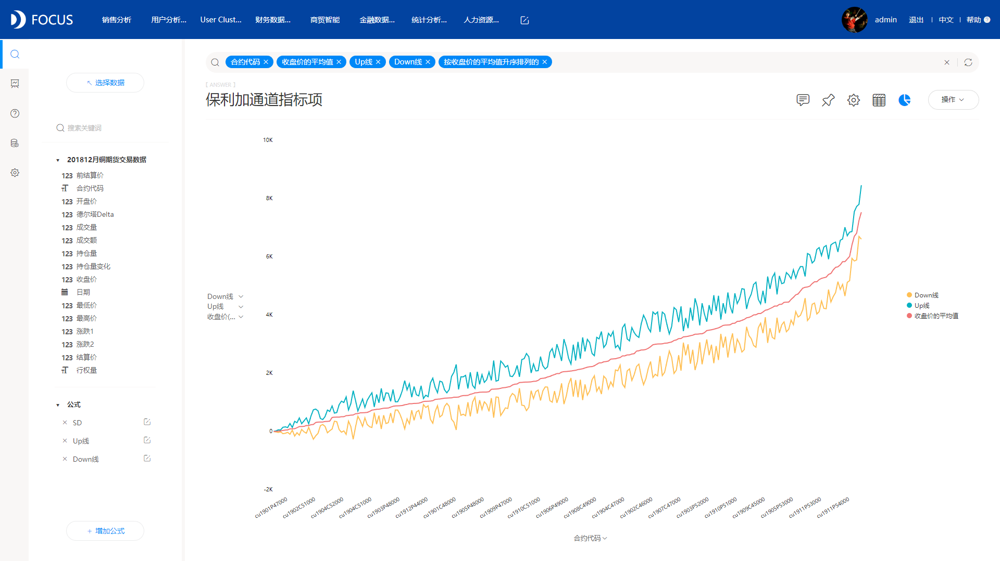
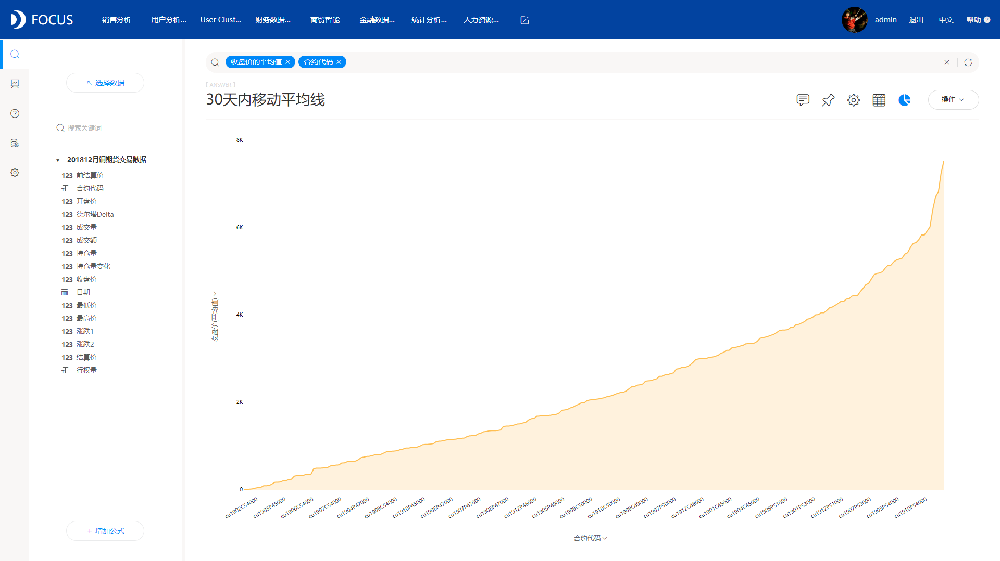

近几年来，大数据、区块链、人工智能、云计算等新技术的迅速发展，推动了新技术与金融业务的深度融合，从而激发了金融行业的新鲜活力和应用潜能，这不仅推动了我国金融行业的转型升级，而且还助力金融行业更好地服务实体经济，有效促进了金融业整体发展。金融行业数据的整合、共享和开放正在成为趋势，给金融行业带来了新的发展机遇和巨大的发展动力。

今天，我们主要介绍金融行业的数据分析应用。本文所使用的数据分析工具为DataFocus。因其分析操作简单，功能强大，故我们采用DataFocus这款工具。

1、相对强弱指数RSI

相对强弱指数RSI是根据一定时期内上涨点数和涨跌点数之和的比率制作出的一种技术曲线。能够反映出市场在一定时期内的景气程度。

在DataFocus，我们利用公式很容易就制作出RSI指标，结果如下图：

2、保利加通道指标项

保利加通道也称为布林线，其是根据统计学中的标准差原理设计出来的一种非常实用的技术指标。它由三条轨道线组成，其中上下两条线分别可以看成是价格的压力线和支撑线，在两条线之间是一条价格平均线，一般情况价格线在由上下轨道组成的带状区间游走，而且随价格的变化而自动调整轨道的位置。当波带变窄时，激烈的价格波动有可能随即产生；若高低点穿越带边线时，立刻又回到波带内，则会有回档产生。

在DataFocus中，我们先计算出Up线和Down线，然后在计算价格平均线，最后统一放入折线图中，效果如下图所示：

3、移动平均线

移动平均线，简称MA，MA是用统计分析的方法，将一定时期内的证券价格（指数）加以平均，并把不同时间的平均值连接起来，形成一根MA，用以观察证券价格变动趋势的一种技术指标，其是当今应用最普遍的技术指标之一，它帮助交易者确认现有趋势、判断将出现的趋势、发现过度延生即将反转的趋势。

在DataFocus中，可以直接得出价格的平均值，并以折线图展示，效果如下：

