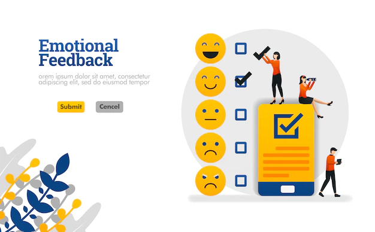
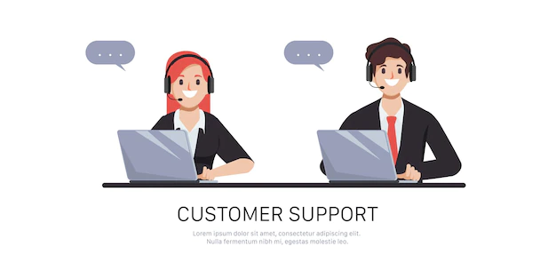
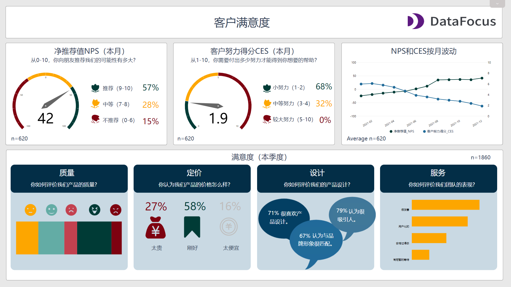

客户满意度得分（CSAT）是客户满意度调研中最常用到的方法之一，可以非常直观的衡量被调研者对此次调研服务的满意度评价。CSAT通常用1-5分的分数形式对服务进行打分，收集用户对即时的满意度的反馈，是一个非常直观衡量客户满意度的指标。

当然，光是得到这个客户满意度得分(CSAT)还是不够的，我们需要通过对比了解到我们的客户满意度得分是高的还是偏低的。因此，需要设定一个客户满意度得分(CSAT)基准。当然，这个基准能否满足公司的实际需求，就是这篇文章主要讨论的内容——如何设定一个满足公司实际的客户满意度得分(CSAT)基准。

## **准备工作**

每个公司的客户支持团队都是不同的，甚至同一公司的不同客户支持团队也是不一样的，因此在深入研究基准测试之前需要考虑一些问题：

例如：您的报告期是什么时候？您是否正在测量当月、过去6个月或其他时间的CSAT分数？团队有多少成员？未来会增长还是收缩？等等

这些前提条件最终都将会影响总体得分。基于上述前提，本文将为客户支持团队介绍多种找到切合实际的CSAT基准的方法，并着重介绍每个方法的优劣势。

## **内部基准测试**

内部基准测试使用的是组织内部的数据，涉及支持团队的历史数据、不同团队之间的对比或者不同地区之间的对比。

在选定内部基准时，需要确定最相关的时间范围和平均值。如果公司的业务经历季节性变化（常见于B2C，例如圣诞节、万圣节等），客户联系激增，但公司没有提前做好准备，CSAT极有可能受到影响；其次，不建议将同类产品与意外需求时间进行比较，因为它不能真实反映团队的可实现目标。因此，需要提前选定适当的比较时间框架，用于设定可行的目标。

### **内部基准的优势**

l 数据更可靠。来自本公司的内部历史数据永远比外部基准更可靠，因为您不可能找到一家业务结构极其相似的企业和自己企业做对比，在公司规模、预算、行业、团队结构、目标、业务阶段等存在太多变数。

l 如果公司内部有多个类似或比较相关的团队，使用内部基准测试也是比较好的。

### **内部基准的缺点**

l 无法获取行业现状。内部基准测试不能客观了解，与行业内的其他公司相比，您的表现如何。如果没有对宏观的行业背景的了解，就算您的表现看起来不错，也可能不具备竞争优势或者无法满足客户的需求。

l 庞大的历史数据可能会造成内部基准测试的时间范围难以确定，那么很难制定出准确的基准。

l 对于正在经历重大变化的公司，历史数据的准确性不够。

## **外部基准测试**

外部基准测试的数据则是来源于公司以外的，可以通过找一些与本公司类似度较高的企业，也可以使用公开的行业基准。

联络交流一些行业内的类似组织是一种比较具有参考意义的方法。借鉴的企业和您的公司相似度越高，基准比较的相关性也就越高。

公开的行业基准则通常是收集整合大量组织的外部研究数据，公司可以直接查看其自身绩效的整体行业平均水平。

对于客户支持基准，Zendesk在收集广泛行业的数据方面做得挺好的。以下是Zendesk基于其4.86亿客户的平均每月数据，整理的CSAT基准、首次响应时间(FRT)、平均呼叫处理时间、每月平均请求量以及每个行业内公司拥有的帮助中心文章的平均数量。

<table><tbody><tr><td><strong>行业</strong></td><td><strong>CSAT</strong></td><td><strong>FRT</strong></td><td><strong>平均呼叫处理时间</strong></td><td><strong>每月请求量</strong></td><td><strong>帮助中心文章</strong></td></tr><tr><td>教育</td><td>94%</td><td>4小时</td><td>1.6分钟</td><td>1,162</td><td>28</td></tr><tr><td>能源</td><td>91%</td><td>5小时</td><td>2.3分钟</td><td>3,145</td><td>18</td></tr><tr><td>娱乐&amp;游戏</td><td>81%</td><td>10小时</td><td>1.4分钟</td><td>7,226</td><td>47</td></tr><tr><td>金融服务</td><td>87%</td><td>3小时</td><td>1.7分钟</td><td>7,152</td><td>39</td></tr><tr><td>政府&amp;非营利</td><td>96%</td><td>3小时</td><td>1.7分钟</td><td>979</td><td>18</td></tr><tr><td>卫生保健</td><td>92%</td><td>3小时</td><td>1.9分钟</td><td>1,928</td><td>24</td></tr><tr><td>IT&amp;咨询</td><td>94%</td><td>2小时</td><td>1.7分钟</td><td>1,007</td><td>15</td></tr><tr><td>营销&amp;广告</td><td>90%</td><td>4小时</td><td>1.8分钟</td><td>1,936</td><td>16</td></tr><tr><td>媒体&amp;通讯</td><td>89%</td><td>2小时</td><td>1.8分钟</td><td>3,249</td><td>36</td></tr><tr><td>专业&amp;商业支持服务</td><td>93%</td><td>3小时</td><td>1.9分钟</td><td>2,949</td><td>20</td></tr><tr><td>房地产</td><td>91%</td><td>2小时</td><td>1.6分钟</td><td>3,967</td><td>20</td></tr><tr><td>零售</td><td>86%</td><td>10小时</td><td>1.5分钟</td><td>4,884</td><td>17</td></tr><tr><td>社交媒体</td><td>81%</td><td>11小时</td><td>1.5分钟</td><td>10,862</td><td>63</td></tr><tr><td>技术</td><td>92%</td><td>2小时</td><td>2.4分钟</td><td>2,639</td><td>80</td></tr><tr><td>旅行</td><td>86%</td><td>3小时</td><td>2分钟</td><td>18,331</td><td>29</td></tr><tr><td>其他</td><td>90%</td><td>4小时</td><td>1.5分钟</td><td>4,468</td><td>13</td></tr></tbody></table>

### **外部基准的优势**

l 借助外部信息，可以协助借鉴类似团队的表现，更符合客户对支持团队互动时的期望。

l 对于刚开始组建客户支持团队的公司来说，了解行业的平均水平是很有必要的。

### **外部基准的缺点**

l 数据获取来源有限。例如，上述的Zendesk收集的行业基准通常是他们自己的平台内获取的数据。

l 比较必须是在类似市场经营的类似公司和类似商业模式，否则，得出的基准没有很大的参考价值。

l 每家公司都有自己的复杂性。就算从外部看起来业务结构是类似的，但不同的内部战略和指标介绍，也会让他们的基准存在很大差异。

l 行业基准更是，完全没有考虑具体公司会出现的特殊情况或者异常数据，只是简单提供一个平均值。

## **设置CSAT分数的步骤**

### **1.首先查看内部数据**

从多个方面先了解整理公司的历史数据：

l 检查历史CSAT分数

l 查看产品订阅的流失率——是否存在某个指标与CSAT分数有任何相关性？

l 借助评论平台了解客户情绪

### **2.查看外部基准报告**

l 将公司现有的性能与外部基准进行比较

l 根据公司确定可比较的外部数据的程度。计算方法一样吗？被衡量的公司之间是否存在巨大差异？

l 从网络中获取见解，多与类似公司的人进行交流

### **3.用经验判断来设定适当的目标**

l 如果CSAT随着时间的推移一直在提高，您可能只想保持现有分数、继续增长或提高比率；

l 如果CSAT一直在下降，那么您可能希望对其进行改善并恢复稳定

l 如果CSAT分数持续为负，那么可以提出疑问——您设定目标的目标会不会存在问题？

如果客户支持团队无法更改的特定问题出现定期负CSAT分数的趋势，那么可以和公司成员提出该问题，讨论是否需要降低基准。

## **确定了CSAT后，下一步是什么？**

通过上述的操作，您的团队可能已经取得了非常高的CSAT分数。但是，总有部分的负分无法消除，而设定更高的目标不太现实，这时候，就需要转向其他目标，保持高水平的服务、提高对满意度调查的响应率，或关注其他补充指标，例如净推荐值(NPS）或客户努力分数（CES）等。

 

例如上图通过DataFocus系统制作的数据看板，整合了新的净推荐值(NPS）和客户努力分数（CES），用以衡量团队服务质量和客户忠诚度。
