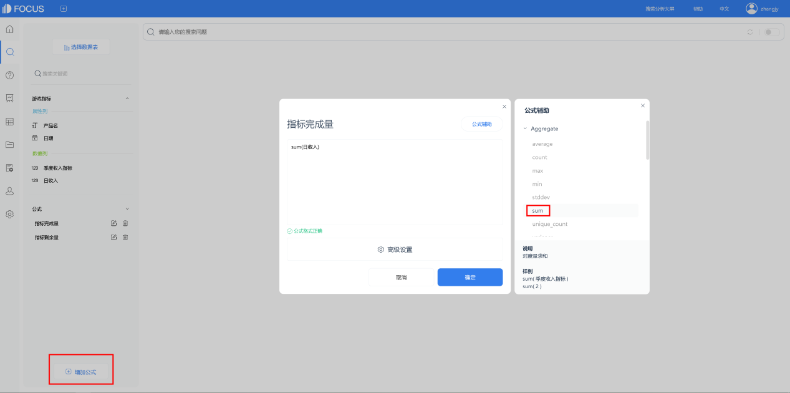
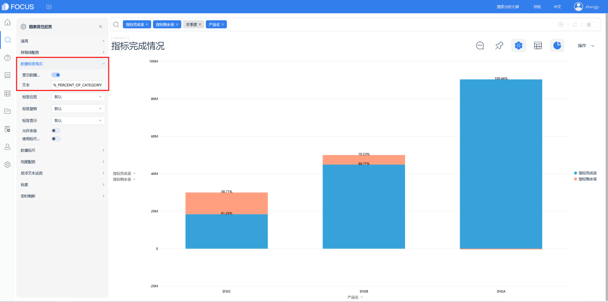

数据分析项目中经常会出现一些错误，影响最终的数据分析，对于数据分析人员来说会暴露出很多数据项目在运行过程中遇到的问题，可以引以为戒。今天我们将与DataFocus一起来讨论常遇到的错误。  
1、 不监控最终结果  
使用控制组的另一部分是测量模型输出的效果，您需要在整个过程中跟踪它，或者最终针对错误的目标进行优化。  
斯泰内特指出，一些公司使用机器人提供电话服务，而不是继续检查机器人是否能带来更高的客户满意度，只是为了降低人工成本。如果客户因为机器人不能给他们正确的答案而结束协作，而不是因为他们解决了他们的问题，那么客户满意度将急剧下降。  
2、 忽略业务专家的作用  
如果您认为所需的所有答案都在数据中，开发人员或数据科学家可以自己找到答案，那就是一个很大的错误。您必须确保了解实际业务问题的人员参与了工作。在启动项目时，甚至在查看数据之前，应在数据团队和业务专家之间进行对话，以确保每个人都了解项目将实现的目标。然后，您可以进行探索性数据分析，看看是否可以实现它。如果没有，您可能需要以新的方式重新解释问题，或使用其他数据源。但是，这个特定领域的专家应该帮助确定目标是什么以及项目是否符合目标。  
3、 选择过于复杂的工具  
机器学习的最前沿是令人兴奋的，新技术可以非常强大，但它们也可能是多余的，可能只是一个简单的方法就可以完成这项工作，那何乐而不为呢。  
很容易使用大量的计算机资源和复杂的模型来解决问题。也许我对一个项目的某个方面有很好的理解，我想测试一个新的算法，这个算法可以做的不仅仅是要求。或者我只是想知道我是否能找到解决这个问题的简单方法。在使用复杂方法之前，应该考虑所有简单的方法。

过度拟合更可能发生在像深度学习这样的复杂算法中，可能会使新数据与原始模型不一致。  
您应该与业务专家讨论目标并选择技术。许多数据科学家专注于机器学习，机器学习通常与预测有关。但并非您遇到的每一个问题都是预测问题。我们需要关注上一季度的销售情况，这可能意味着很多不同的事情。无论我们是否需要预测新客户的销售情况，您可能只需要了解上周销售情况不佳的原因。  
  
4、 选择不合适的模型  
有许多数据科学和机器学习的例子，你可以从中学习和适应。数据科学呈指数级增长的原因之一是几乎所有的算法开源模型都可用，这使得快速开发模型变得容易。但这些模型通常是针对特定用例而开发的。如果您需要系统中的不同功能，那么最好建立自己的版本。实施自己的数据清理和功能构建过程，让你有更多的控制权。

  
5、 曲解基本概念和基础原理  
当您没有足够的数据用于单独的训练集时，交叉验证可以帮助您评估预测模型的准确性。对于交叉验证，您可以多次设置数据并使用培训的不同部分。然后分阶段测试模型，以确定无论您使用哪个数据集进行培训，是否可以获得相同的准确度。  
但是不能用它来证明你的模型总是像交叉验证得分一样准确。归纳模型是一种能够准确响应新输入数据的模型，但交叉验证永远无法证明这一点。它只使用已有的数据，所以反而可能的最准确数据。对数据集的探索性绘图可以让你了解它可以预测的内容以及不会的那些以及一些事情的相关性。  
6、 低估用户的理解能力

企业用户可能无法自己进行统计分析，但这并不意味着他们不了解误差范围，统计显着性和有效性的指标。通常，当分析报告提交给业务团队时，它最终将成为只有一个数字的幻灯片。无论是准确的数字，估计还是预测，误差幅度都非常重要。如果您根据数据分析做出业务决策，您应该清楚地解释解释的结果，以说服系统的决策者。不要以为他们在技术上不了解任何东西，也不能理解结果。
