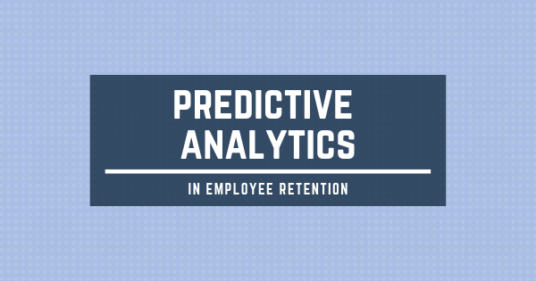

美国劳工统计局报告称，2018 年：

- 美国工人的平均雇员任期为 4.2 年。
- 55 至 64 岁工人的平均雇员任期为 10.1 年。对于 25 至 34 岁的人来说，是 2.8 岁。

同样，人力资源管理协会2016 年有效工作场所指数发现，在高效工作场所中，77% 的员工“根本不可能”离开，而在工作场所被认为效率较低的员工中，这一比例为 30%。该指数进一步确定了员工留任概率最高的三大因素：

1. 对工资、福利和晋升机会的满意度
2. 工作/生活契合
3. 自主权（与角色相称）

虽然年龄和任期似乎直接相关，但在一份工作上花费不到三年的千禧一代和 Z 世代构成了“流失”，这对任何公司来说都是代价高昂的——应该预测并随后加以缓解。

但正如 SHRM 指数显示的那样，这是一条双向的道路。公司在保留结果方面同样是同谋。

## 每个人都去哪里？

当劳动力市场收紧时，这些统计数据反映了一个更大的问题：公司未能采取措施留住合格和训练有素的人才。再加上越来越多似乎沉迷于跳槽的千禧一代和 Z 世代员工，整个留住概念似乎已经过时了。

未能解决高营业额问题的公司会走上危险的道路。与新员工入职和培训相关的巨额费用使得优秀人才得到奖励、晋升和留住至关重要。谁愿意眼睁睁地看着在时间和技能上的投资——可能还有出色的生产力——走出家门？

## 为什么保留很重要

经验证据表明，年度评审、同行推荐、拿铁咖啡机和星巴克茶歇对劝阻离职者几乎没有作用。当他们离开时，数千美元的入职和培训费用也随之而来。

美国进步中心的一份报告发现，更换一名员工可能会花费一个职位工资的 16% 到 21%。将这个百分比乘以在指定时间段（例如，一年？）内离职的几到几十名员工，金钱和人员的损失就会增加。

那么，您如何设法留住人员？您是否在娱乐室中添加了泡泡曲棍球比赛？继续加薪 10% 以让每个人都“值得”留下来？强制不竞争协议？

当然，这取决于分析的内容。因为正如彼得·德鲁克 (Peter Drucker) 的名言：“如果你能衡量它，你就能管理它。” 在不首先查看汇总数据的情况下考虑纠正员工保留计划，最终将产生相同的结果。因此，让我们将数据标记为“劳动力分析”，看看BI 如何帮助减少员工流动率。

## 劳动力分析——它是什么？

连接原始劳动力池数据以披露和分享将导致更好的业务决策（尤其是提高员工保留率）的洞察力背后的艺术和科学是劳动力分析的全部内容。这是一种不仅可以了解人员发生了什么，而且可以了解_为什么_会发生、接下来_会_ _发生_什么以及最终如何调整符合公司目标和文化并让员工参与其中的劳动力战略的方法。

几乎任何涉及员工生命周期的数据都可以衡量：每次雇佣成本、招聘来源、晋升率、辞职率、流动成本、劳动力流动率甚至收益率。将这些个人数据结合到分析中，公司可以探索辞职驱动因素和相关性；人员流失对业务指标的影响；以及培训对晋升、留任和退休趋势的影响。

这些洞察力使企业高管能够就成本管理和人员保留问题上做出更明智的决策。员工分析表明，公司管理员工的方式可能是员工流失或留任的最大原因。

然而，为了减少员工流失，人力资源团队需要更多地以数据为导向，回顾过去简单的描述性分析（人口统计），转向更多的探索性分析（为什么最近有这么多 31 岁的人离开）。更好的是，他们应该关注预测分析（这些数据表明这种趋势将继续下去，所以我们必须解决它。）

## 预测分析——它能做什么？

预测分析和其他基于数据的技术可以帮助简化招聘流程，同时确定最优秀的人才，更重要的是——稳固的文化契合度。预测分析通过分析历史数据以预测未来结果。

使用预测分析，雇主可以更深入地分析员工流失的潜在原因。这种深入研究使管理者能够迅速调整计划、政策和工作环境，即使不能完全防止员工流失，也应该抑制这种情况。事实上，研究表明，聘用与技能、文化、角色偏好等方面会促进员工的入职，并让那些工作时间长、表现好的员工融入公司。

例如，关于员工绩效和学习投入的数据可以预测员工的长期学习和成长潜力。这可以建议人力资源干预，个人可以通过特殊培训、指导、辅导等方式获得支持，以实现目标。精明地采用这种“智慧”可以满足员工的个人需求和要求，从而形成信任和透明的文化，最终促进更大的保留率。

## 预测分析 - 它不能做什么？

近期其他劳动力分析研究的结果显示了关于人员流动的一个关键因素：人们会不断跳槽，直到找到一个公司的经理和流程都与员工的技能和期望相称的职位。

因此，企业有责任对理想员工的资质和特征进行衡量、监控和汇总，所以在招聘候选人时，个人与公司之间的匹配是既成事实。

毕竟，留住员工比寻找和培训新员工要便宜。不足为奇的是，今天采用劳动力分析比以往任何时候都能对组织的 最终赢利产生积极影响。
