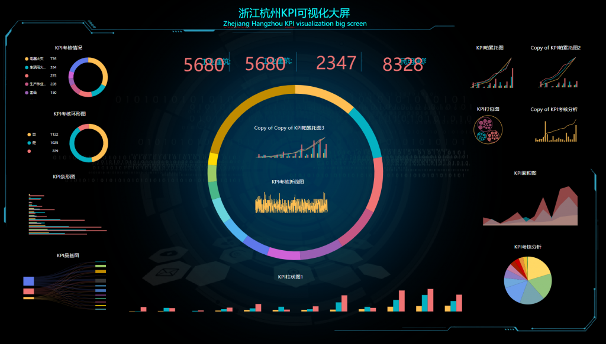

不知道大家有没有看过这样一则小故事：说有3个人去投宿，一晚30元，三个人每人掏了10元凑够30元交给了老板。後来老板说今天优惠只要25元就够了，拿出5元命令服务生退还给他们,，但是服务生偷偷藏起了2元，然后把剩下的3元钱分给了这三个人，每人分到了1元。这样，一开始每人掏了10元，现在又退回1元，也就是10-1=9，每人只花了9元钱,，3个人每人花费9元，3 X 9 = 27 元 + 服务生藏起的2元=29元，那么问题来了，还有一元钱去了哪里？

看完上述这个问题，是不是同样感受到了疑惑？猛地一想，好像确实少了一元，但是仔细琢磨一下，你会发现，这一切都是“障眼法”，很容易就会陷入思维陷阱，我们从财务的角度来看，支出总共是3\*9=27元，收入总共是25+2=27元，支出等于收入，是平衡的，并没有少一元。

上面这则小故事，其实就是一个最日常的数据分析，因为我们想要了解故事中的“问题”出在哪儿，所以我们进行了数据分析，这就是数据分析的作用。在企业日常业务中，我们也需要数据分析，但是由于企业的数据量十分庞大，而且数据需求相对复杂，所以必须借助于专业的数据分析工具，例如DataFocus、Tableau等，工具的选择会直接影响企业数据分析的效率，从而间接影响企业的收益，所以对于企业的数据分析来说，选对工具是关键。

类似有趣的小故事还有很多，这只是其中一个，数据分析源于生活，也作用于生活。

